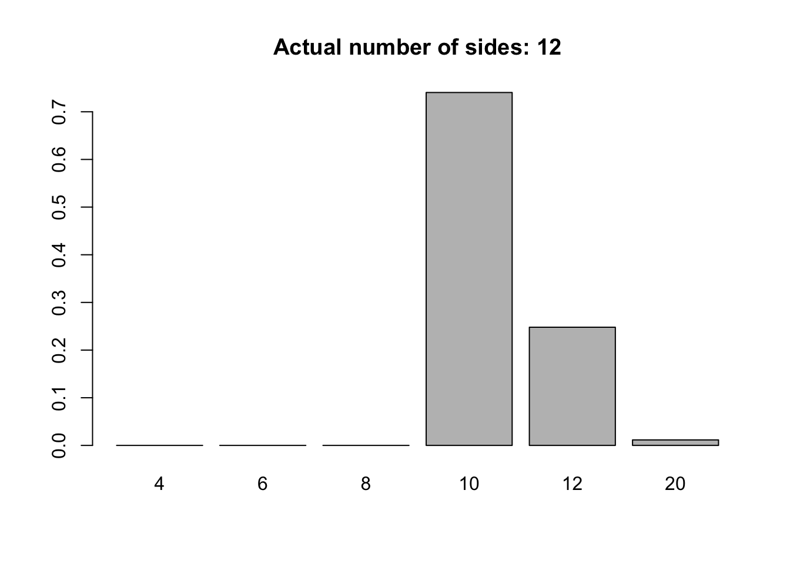

# Class 3

## Bayes' Theorem Practice

:::{.example #dice-1 name="Single roll" .lizi}
Suppose that your friend has 3 dice. One has 4 sides, one has 6 sides, and one has 8 sides. He draws one die at random, rolls it one time without showing you, and reports the result as having rolled a 2. How would you calculate the probability that the die was the 4 sided die, the probability for the 6 sided die, and the probability for the 8 sided die?
:::


```r
# prior probabilities: P(n=4), P(n=6), P(n=8)
prob.prior = rep(1/3, 3)

# likelihood probabilities: P(roll=2 | n=4), etc.
prob.likelihood = c(1/4, 1/6, 1/8)

# posterior probabililities P(n=4 | roll=2)
prob.posterior = prob.prior * prob.likelihood/sum(prob.prior *
    prob.likelihood)

prob.posterior
[1] 0.4615385 0.3076923 0.2307692

c(6, 4, 3)/13
[1] 0.4615385 0.3076923 0.2307692
```


:::{.example #dice-n name="Multiple rolls" .lizi}
Now suppose there are 6 possible dice, one with 4 sides, one with 6 sides, one with 8 sides, one with 10 sides, one with 12 sides, and one with 20 sides. After randomly selecting a die, the die is rolled n times and the outcomes are reported. Numerically calculate the probabilities for the number of sides of the randomly selected die. 
:::


```r
dice = c(4, 6, 8, 10, 12, 20)

num.sides = sample(dice, 1)

num.rolls = 6

rolls = sample(1:num.sides, num.rolls, replace = TRUE)

rolls
[1] 8 9 7 9 7 9

prior = rep(1/6, 6)

likelihood = (1/dice)^num.rolls * (max(rolls) <= dice)

marginal = sum(prior * likelihood)

posterior = (prior * likelihood)/marginal

posterior
[1] 0.00000000 0.00000000 0.00000000 0.74045390 0.24797651
[6] 0.01156959

barplot(posterior, names = dice, main = paste0("Actual number of sides: ",
    num.sides))
```




:::{.exercise #erroneous-dice name="Erroneous dice" .prob}
Suppose there are 6 possible dice: one with 4 sides, one with 6 sides, one with 8 sides, one with 10 sides, one with 12 sides, and one with 20 sides. After randomly selecting a die, the die is rolled n times and the outcomes are reported but with some possible errors in the reported rolls. We will assume that if there's an error for any given roll, it will be a random number between 1 and 20. Incorporate an error rate into the likelihood with a uniform prior. Given a vector of rolls, such as `rolls` below, calculate and graph the posterior probabilities of the error rate and number of sides. 


```r
dice=c(4,6,8,10,12,20)
num.sides = sample(dice,1)
n = 10
error.param=runif(1)
errors.ind=rbinom(n,1,prob=error.param)
errors.values = sample(1:20,sum(errors.ind),replace=T)

rolls = sample(1:num.sides,n,replace=TRUE)
rolls[which(errors.ind==1)]=errors.values
rolls
 [1] 7 4 7 3 2 4 7 8 6 7
```

:::

