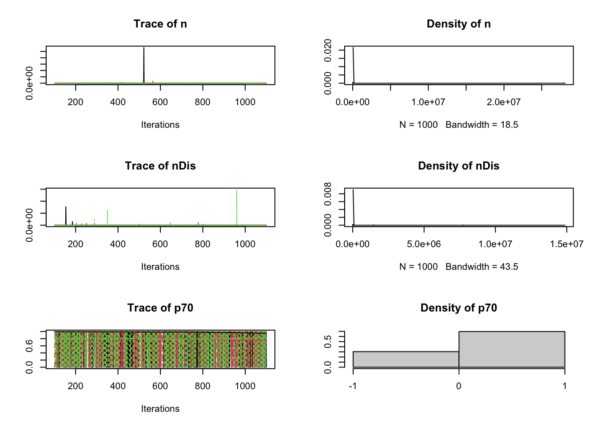

# Class 11: Prior distributions


:::{.example #power-analysis name="Power analysis" .lizi}

We consider the sample size estimation of a two-arm randomized trial with a continuous primary outcome and $n$ subjects randomized to each arm. Assuming a normal distribution of the primary outcome and a common within-treatment standard deviation of $\sigma$, the estimated treatment effect is assumed to have a $\mathcal{N}(\theta,2\sigma^2/n)$ distribution. Thus, the [sample size determination](https://en.wikipedia.org/wiki/Sample_size_determination#Cumulative_distribution_function) is found to be
\[
n=\frac{2\sigma^2}{\theta^2}\left(z_{1-\alpha/2}+z_{1-\beta}\right)^2,
\]
where $z_p=\Phi^{-1}(p)$. Solving for $1-\beta$ gives
\[
\text{Power}=\Phi\left(\sqrt{\frac{n\theta^2}{2\sigma^2}}-z_{1-\alpha/2}\right).
\]
Supposing historical data suggests $\theta$ likely (interpreted as 1 standard deviation) to be between 3 and 7 suggests the prior $\theta\sim\mathcal{N}(5,2^2)$. The parameter $\sigma$ is estimated to be around 10 and based on around 40 observations. This leads to a $\mathrm{GammaSR}(a,b)$ prior for $\tau=1/\sigma^2$ with $a/b=1/10^2$ and $2a=40$; i.e. $\tau\sim\mathrm{GammaSR}(20,2000)$. Another set of priors are considered: the prior for $\sigma$ is assumed to be based on 20 observations instead of 40 (effectively a power prior) leading to the modified prior distribution $\tau\sim\mathrm{GammaSR}(10,1000)$, and the prior for $\theta$ is assumed to have a mean bias of -1 with standard deviation of 2 with the constraint that $\theta>0$ thus leading to the modified prior distribution $\theta\sim \mathcal{N}^+(5-1,2^2+2^2)$.

\vspace{.2cm}

The Type I error $\alpha$ is set to $0.05$. Three quantities are tracked: (i) the calculated sample size $n$ for 90\% power, (ii) that power based on $n=84$ (frequentest estimate with fixed $\theta=5$, $\sigma=10$, and 90\% power), and (iii) with $n=84$, the probability the power is at least 70\%. 

:::


```r
library(rjags)

model ="
model{

 tau ~ dgamma(20, 2000)
 tauDis ~ dgamma(10, 1000) # discounted by 2
 
 sigma <- 1/sqrt(tau) 
 sigmaDis <- 1/sqrt(tauDis) 
 
 theta ~ dnorm(5, 0.25) 
 thetaDis ~ dnorm(4, 0.125) I(0,)  # 4 added to var and shifted by -1, constrained to be >0
 
 n <- 2*pow((1.28 + 1.96)*sigma/theta, 2) # n for 90% power 
 power <- phi(sqrt(84/2)*theta/sigma - 1.96) # power for n = 84 
 p70 <- step(power - 0.7) # Pr(power > 70%)
 
 nDis <- 2*pow((1.28 + 1.96)*sigmaDis/thetaDis, 2) # n for 90% power 
 powerDis <- phi(sqrt(84/2)*thetaDis/sigmaDis - 1.96) # power for n = 84 
 p70Dis <- step(powerDis - 0.7) # Pr(power > 70%)
 }"


data=list()
jmodel <- jags.model(textConnection(model), data = data,n.chains = 3, n.adapt= 100,quiet=TRUE)
update(jmodel, 100)
mcmc_samples <- coda.samples(jmodel, variable.names=c("n","power","p70","nDis","powerDis","p70Dis"), n.iter=1000)
plot(mcmc_samples)
```



```r
summary(mcmc_samples)

Iterations = 101:1100
Thinning interval = 1 
Number of chains = 3 
Sample size per chain = 1000 

1. Empirical mean and standard deviation for each variable,
   plus standard error of the mean:

              Mean        SD  Naive SE Time-series SE
n        1.416e+03 3.457e+04 6.312e+02      6.312e+02
nDis     4.274e+07 2.326e+09 4.246e+07      4.246e+07
p70      7.007e-01 4.580e-01 8.363e-03      8.513e-03
p70Dis   5.467e-01 4.979e-01 9.090e-03      9.087e-03
power    7.706e-01 2.661e-01 4.859e-03      4.883e-03
powerDis 6.602e-01 3.259e-01 5.950e-03      5.950e-03

2. Quantiles for each variable:

             2.5%     25%      50%      75% 97.5%
n        23.90597 53.0114  88.2762 166.9580  1730
nDis     20.83304 58.8898 123.6087 317.4457 13747
p70       0.00000  0.0000   1.0000   1.0000     1
p70Dis    0.00000  0.0000   1.0000   1.0000     1
power     0.10199  0.6324   0.8850   0.9829     1
powerDis  0.04394  0.3846   0.7614   0.9719     1
```

:::{.example #great name="GREAT study" .lizi}
The \mywiki{https://en.wikipedia.org/wiki/Grampian}{Grampian} region early \mywiki{https://en.wikipedia.org/wiki/Anistreplase}{anistreplase} trial (GREAT) \cite{Group:1992} found that patients with suspected acute myocardial infarction had lower 3-month mortality if treated early with \href{https://en.wikipedia.org/wiki/Thrombolysis}{thrombolysis}. 

\begin{center}
\begin{tabular}{ccccc}
\hline
      &          & \multicolumn{2}{c}{Treatment} & total \\
      &          & anistreplase     & placebo    &       \\ \hline
Event & death    & 13               & 23         & 36    \\
      & no death & 150              & 125        & 275   \\ \hline
total &          & 163              & 148        & 311   \\ \hline
\end{tabular}
\end{center}


Let $r_j$, $n_j$, and $p_j$ denote the number of deaths, total number of patients, and underlying mortality rate, respectively, in group $j\in\{1,2\}$ (1=anistreplase; 2=placebo).  We are interested in conducting inference on the log-odds ratio for mortality in the anistreplase group compared to placebo; i.e. 
\[
\theta=\log\left\{\frac{p_1/(1-p_1)}{p_2/(1-p_2)}\right\}=\text{logit}(p_1) - \text{logit}(p_2)
\]
A natural estimator of $\theta$ is
\[
\hat{\theta}=\log\left\{\frac{r_1/(n_1-r_1)}{r_2/(n_2-r_2)}\right\} \approx -0.753
\]
\mystack{https://stats.stackexchange.com/questions/266098/how-do-i-calculate-the-standard-deviation-of-the-log-odds}{with variance}
\[
\text{Var}(\hat\theta)\approx \frac{1}{r_1}+\frac{1}{r_2}+\frac{1}{n_1-r_1}+\frac{1}{n_2-r_2}\approx 0.135
\]

The following Bayesian models are considered.


**Model A (normal dist on effect, uniform prior):** $\hat\theta\sim\mathcal{N}(\theta,0.135)$ with $\theta\sim\text{Uniform}(-10,10)$. 

**Model B (binomial dist on rates, Jeffreys priors):** $r_j\sim\text{Binomial}(p_j,n_j)$ with $p_j\sim\Beta(.5,.5)$, $j=1,2$.  

**Model C (binomial dist on rates, logit transform, clinical prior):** The parameters $p_1$ and $p_2$ are reparameterized in terms of $\alpha$ and $\theta$ as 
\[
\begin{split}
\text{logit}(p_1) &= \alpha + \theta/2\\
\text{logit}(p_2) &= \alpha - \theta/2
\end{split}
\]
The $\alpha$ is a nuisance parameter and is given a practically flat prior: $\alpha\sim\mathcal{N}(0,100^2)$. The "clinical" prior for $\theta$ is based on expert elicitation: a senior cardiologist, informed by one unpublished and two published trials, expressed belief that "an expectation of 15-20\% reduction in mortality is highly plausible, while the extremes of no benefit and a 40\% relative reduction are both unlikely".

This is translated into a 95\% interval for the odds ratio being (.6,1), which corresponds to the interval (-.51,0) on the log-odds scale. A normal distribution with this property leads to $\theta\sim\mathcal{N}(\mu_0,\sigma_{0}^2)$, where $\mu_0=(-.51+0)/2=-.26$ and $\sigma_0=.26/1.96\approx .13$.

**Model D (binomial dist on rates, logit transform, skeptical prior):** This model follows the same approach as Model C but with a ``skeptical'' prior placed on $\theta$ to avoid early stopping of trials due to fortuitously positive results.  Specifically, a prior for $\theta$ is constructed to have a 95\% confidence interval of (.5, 2) on the odds ratio scale, which is equivalent to the interval of (-.69,69) on the log-odds scale. A normal distribution with this property leads to $\theta\sim\mathcal{N}(0,.35^2)$. 

:::


```r
(mat=matrix(c(13,150,23,125),nrow=2,ncol=2,dimnames=list(c("death","no death"),c("anistreplase","placebo"))))
         anistreplase placebo
death              13      23
no death          150     125
fisher.test(mat)

	Fisher's Exact Test for Count Data

data:  mat
p-value = 0.05002
alternative hypothesis: true odds ratio is not equal to 1
95 percent confidence interval:
 0.2104046 1.0183476
sample estimates:
odds ratio 
 0.4721467 
```


```r
model= function(){

  pr.mean[1] <- -0.26
  pr.sd[1] <- 0.13 # clinical prior
  
  pr.mean[2] <- 0
  pr.sd[2] <- 0.35 # skeptical prior
  
  
  ## Likelihoods
  
  # Model A
  theta.mle ~ dnorm(thetaA, 1/.135) 
  
  # Model B
  r.rep[1,1] ~ dbin(pB[1],n.rep[1,1])
  r.rep[1,2] ~ dbin(pB[2],n.rep[1,2])
  
  thetaB <- logit(pB[1]) - logit(pB[2])
  
  # Model C
  r.rep[2,1] ~ dbin(pC[1],n.rep[1,1])
  r.rep[2,2] ~ dbin(pC[2],n.rep[1,2])
  
  logit(pC[1]) <- alphaC + thetaC/2
  logit(pC[2]) <- alphaC - thetaC/2
  
  # Model D
  r.rep[3,1] ~ dbin(pD[1],n.rep[1,1])
  r.rep[3,2] ~ dbin(pD[2],n.rep[1,2])
  
  logit(pD[1]) <- alphaD + thetaD/2
  logit(pD[2]) <- alphaD - thetaD/2
  
  ## priors
  
  # Model A
  thetaA ~ dunif(-10, 10) # locally uniform prior
  
  # Model B
  pB[1] ~ dbeta(0.5, 0.5) 
  pB[2] ~ dbeta(0.5, 0.5) 
  
  # Model C (clinical prior)
  alphaC ~ dnorm(0, 0.0001)
  thetaC ~ dnorm(-.26, 1/pow(.13, 2))

  # Model D (skeptical prior)
  alphaD ~ dnorm(0, 0.0001)
  thetaD ~ dnorm(0, 1/pow(.35, 2))
}

r=c(13, 23)
n=c(163, 148)
r.rep=array(rep(r,each=3),dim=c(3,2))
n.rep=array(rep(n,each=3),dim=c(3,2))

r.rep
     [,1] [,2]
[1,]   13   23
[2,]   13   23
[3,]   13   23
n.rep
     [,1] [,2]
[1,]  163  148
[2,]  163  148
[3,]  163  148

data=list(r.rep = r.rep, n.rep = n.rep,theta.mle= -0.753)


library(R2jags)
fit <- jags(data=data, model=model,parameters.to.save=c("thetaA","thetaB","thetaC","thetaD"), n.chain=2, n.iter=5000, n.thin=1, n.burn=100, DIC=FALSE)
module glm loaded
module dic loaded
Compiling model graph
   Resolving undeclared variables
   Allocating nodes
Graph information:
   Observed stochastic nodes: 7
   Unobserved stochastic nodes: 7
   Total graph size: 50

Initializing model
fit.mcmc <- as.mcmc(fit)
plot(fit.mcmc)
```


```r
summary(fit.mcmc)

Iterations = 101:5000
Thinning interval = 1 
Number of chains = 2 
Sample size per chain = 4900 

1. Empirical mean and standard deviation for each variable,
   plus standard error of the mean:

          Mean     SD Naive SE Time-series SE
thetaA -0.7530 0.3741 0.003779       0.004664
thetaB -0.7473 0.3711 0.003749       0.004767
thetaC -0.3171 0.1227 0.001239       0.002252
thetaD -0.3737 0.2557 0.002583       0.009054

2. Quantiles for each variable:

          2.5%     25%     50%     75%    97.5%
thetaA -1.4841 -1.0046 -0.7609 -0.5050 -0.01045
thetaB -1.5069 -0.9924 -0.7388 -0.4951 -0.04037
thetaC -0.5600 -0.4000 -0.3171 -0.2329 -0.07888
thetaD -0.8795 -0.5459 -0.3697 -0.2014  0.12704
mat=as.matrix(as.mcmc(fit))
boxplot(mat)
abline(h=0)
```


```r

library("bayesplot")
library("ggplot2")
plot_title <- ggtitle("Posterior distributions",
                      "with medians and 95% intervals")
mcmc_areas(mat,
           pars = c("thetaA", "thetaB", "thetaC", "thetaD"),
           prob = 0.95) + plot_title
```


## Bayes factor


:::{.example #octopus name="Paul the psychic octopus" .lizi}
In the 2020 soccer World Cup competition, Paul the psychic octopus correctly made 8 out 8 predictions of the winner. Let $H_0$ represent the hypothesis that the predictions were a coincidence, and let $H_1$ represent the hypothesis that Paul has some psychic ability. More specifically, we ignore the possibility of a draw and assume the predictions follow a binomial distribution with parameter $\theta$ representing the probability of a correct prediction. We wish to compare the following hypotheses 
\[
\begin{split}
    &H_0: \theta=.5\\
    &H_1: \theta\sim\text{Uniform}(.5,1)
\end{split}
\]
:::


```r
model <- function() { 
  q[1] <- 0.5 # prior probabilities
  q[2] <- 0.5 
  
  theta[1] <- 0.5 # H0
  theta[2] ~ dunif(0.5, 1) # H1

  r ~ dbin(theta[pick], n) # likelihood
  pick ~ dcat(q[])
  psychic <- pick - 1 # 1 if psychic, 0 otherwise
  }

Data <- list(r = 8, n = 8)
fit <- jags(Data, model = model, param = c("theta",
    "psychic"), n.chain = 2, n.iter = 10000, n.thin = 1,
    n.burn = 0, DIC = FALSE)
module glm loaded
module dic loaded
Compiling model graph
   Resolving undeclared variables
   Allocating nodes
Graph information:
   Observed stochastic nodes: 1
   Unobserved stochastic nodes: 2
   Total graph size: 9

Initializing model
print(fit)
Inference for Bugs model at "/var/folders/fy/_0t49sys0713k84msqwk44fc0000gp/T//Rtmp5yyCFv/model1518d707f84d2.txt", fit using jags,
 2 chains, each with 10000 iterations (first 0 discarded)
 n.sims = 20000 iterations saved
         mu.vect sd.vect  2.5%   25%   50%   75% 97.5%
psychic    0.983   0.127 1.000 1.000 1.000 1.000 1.000
theta[1]   0.500   0.000 0.500 0.500 0.500 0.500 0.500
theta[2]   0.900   0.089 0.663 0.857 0.925 0.969 0.997
          Rhat n.eff
psychic  1.001 20000
theta[1] 1.000     1
theta[2] 1.005  1200

For each parameter, n.eff is a crude measure of effective sample size,
and Rhat is the potential scale reduction factor (at convergence, Rhat=1).
attach.jags(fit)
hist(theta[,2])
```


In particular, notice how this hypothesis testing problem has been translated into an inference problem. 
