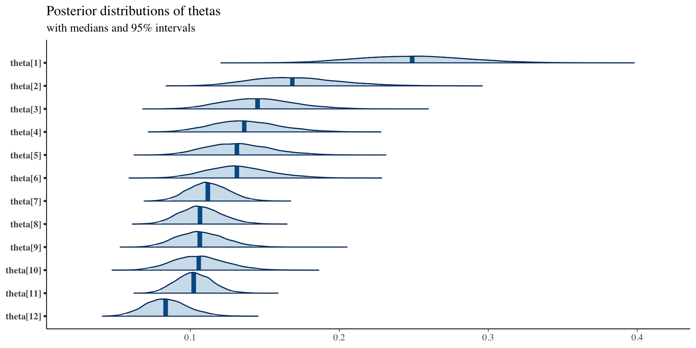

# Class 14: Hierarchical Models

## Example 1: 


```r
library(tidyverse)
library(kableExtra)
bristol = data.frame(hospital = c("Bristol", "Leicester", "Leeds",
    "Oxford", "Guys", "Liverpool", "Southampton", "Great Ormond St",
    "Newcastle", "Harefield", "Birmingham", "Brompton"), operations = c(143,
    187, 323, 122, 164, 405, 239, 482, 195, 177, 581, 301), deaths = c(41,
    25, 24, 23, 25, 42, 24, 53, 26, 25, 58, 31)) %>%
    mutate(mortality = deaths/operations) %>%
    arrange(desc(mortality))

# xtable(bristol,digits=c(0,0,0,0,2))

kbl(bristol) %>%
    kable_classic_2(full_width = F)
```

<table class=" lightable-classic-2" style='font-family: "Arial Narrow", "Source Sans Pro", sans-serif; width: auto !important; margin-left: auto; margin-right: auto;'>
 <thead>
  <tr>
   <th style="text-align:left;"> hospital </th>
   <th style="text-align:right;"> operations </th>
   <th style="text-align:right;"> deaths </th>
   <th style="text-align:right;"> mortality </th>
  </tr>
 </thead>
<tbody>
  <tr>
   <td style="text-align:left;"> Bristol </td>
   <td style="text-align:right;"> 143 </td>
   <td style="text-align:right;"> 41 </td>
   <td style="text-align:right;"> 0.2867133 </td>
  </tr>
  <tr>
   <td style="text-align:left;"> Oxford </td>
   <td style="text-align:right;"> 122 </td>
   <td style="text-align:right;"> 23 </td>
   <td style="text-align:right;"> 0.1885246 </td>
  </tr>
  <tr>
   <td style="text-align:left;"> Guys </td>
   <td style="text-align:right;"> 164 </td>
   <td style="text-align:right;"> 25 </td>
   <td style="text-align:right;"> 0.1524390 </td>
  </tr>
  <tr>
   <td style="text-align:left;"> Harefield </td>
   <td style="text-align:right;"> 177 </td>
   <td style="text-align:right;"> 25 </td>
   <td style="text-align:right;"> 0.1412429 </td>
  </tr>
  <tr>
   <td style="text-align:left;"> Leicester </td>
   <td style="text-align:right;"> 187 </td>
   <td style="text-align:right;"> 25 </td>
   <td style="text-align:right;"> 0.1336898 </td>
  </tr>
  <tr>
   <td style="text-align:left;"> Newcastle </td>
   <td style="text-align:right;"> 195 </td>
   <td style="text-align:right;"> 26 </td>
   <td style="text-align:right;"> 0.1333333 </td>
  </tr>
  <tr>
   <td style="text-align:left;"> Great Ormond St </td>
   <td style="text-align:right;"> 482 </td>
   <td style="text-align:right;"> 53 </td>
   <td style="text-align:right;"> 0.1099585 </td>
  </tr>
  <tr>
   <td style="text-align:left;"> Liverpool </td>
   <td style="text-align:right;"> 405 </td>
   <td style="text-align:right;"> 42 </td>
   <td style="text-align:right;"> 0.1037037 </td>
  </tr>
  <tr>
   <td style="text-align:left;"> Brompton </td>
   <td style="text-align:right;"> 301 </td>
   <td style="text-align:right;"> 31 </td>
   <td style="text-align:right;"> 0.1029900 </td>
  </tr>
  <tr>
   <td style="text-align:left;"> Southampton </td>
   <td style="text-align:right;"> 239 </td>
   <td style="text-align:right;"> 24 </td>
   <td style="text-align:right;"> 0.1004184 </td>
  </tr>
  <tr>
   <td style="text-align:left;"> Birmingham </td>
   <td style="text-align:right;"> 581 </td>
   <td style="text-align:right;"> 58 </td>
   <td style="text-align:right;"> 0.0998279 </td>
  </tr>
  <tr>
   <td style="text-align:left;"> Leeds </td>
   <td style="text-align:right;"> 323 </td>
   <td style="text-align:right;"> 24 </td>
   <td style="text-align:right;"> 0.0743034 </td>
  </tr>
</tbody>
</table>

### Constant-risk model


```r
model= function(){

  ## Likelihood
  for (i in 1:12) {
    y[i] ~ dbin(theta, n[i])
    res[i] <- (y[i] - n[i]*theta)/sqrt(n[i]*theta*(1-theta)) 
    res2[i] <- res[i]*res[i]
    }
  
  ## prior
  theta ~ dunif(0, 1)
  X2.obs <- sum(res2[])

  }


data=list(n = bristol$operations, y=bristol$deaths)

library(R2jags)
fit <- jags(data=data, model=model,parameters.to.save=c("theta","res","X2.obs"), n.chain=2, n.iter=5000, n.thin=1, n.burn=100, DIC=FALSE)
module glm loaded
module dic loaded
Compiling model graph
   Resolving undeclared variables
   Allocating nodes
Graph information:
   Observed stochastic nodes: 12
   Unobserved stochastic nodes: 1
   Total graph size: 102

Initializing model
fit.mcmc <- as.mcmc(fit)
summary(fit.mcmc)

Iterations = 101:5000
Thinning interval = 1 
Number of chains = 2 
Sample size per chain = 4900 

1. Empirical mean and standard deviation for each variable,
   plus standard error of the mean:

           Mean       SD  Naive SE Time-series SE
res[1]   6.1547 0.323333 3.266e-03      4.077e-03
res[10] -0.9186 0.242563 2.450e-03      3.058e-03
res[11] -1.4760 0.377327 3.812e-03      4.757e-03
res[12] -2.5142 0.253401 2.560e-03      3.194e-03
res[2]   2.3427 0.232581 2.349e-03      2.932e-03
res[3]   1.2921 0.241510 2.440e-03      3.045e-03
res[4]   0.8833 0.241826 2.443e-03      3.049e-03
res[5]   0.5896 0.242272 2.447e-03      3.054e-03
res[6]   0.5867 0.247097 2.496e-03      3.115e-03
res[7]  -0.6590 0.357226 3.609e-03      4.503e-03
res[8]  -0.9920 0.319785 3.230e-03      4.031e-03
res[9]  -0.8933 0.274931 2.777e-03      3.466e-03
theta    0.1198 0.005473 5.528e-05      6.897e-05
X2.obs  59.0361 2.700825 2.728e-02      3.567e-02

2. Quantiles for each variable:

           2.5%     25%     50%     75%    97.5%
res[1]   5.5308  5.9307  6.1509  6.3737  6.80357
res[10] -1.3920 -1.0857 -0.9195 -0.7532 -0.43712
res[11] -2.2126 -1.7360 -1.4775 -1.2188 -0.72716
res[12] -3.0103 -2.6885 -2.5147 -2.3411 -2.01277
res[2]   1.8919  2.1819  2.3407  2.5007  2.80743
res[3]   0.8228  1.1253  1.2904  1.4563  1.77355
res[4]   0.4130  0.7164  0.8817  1.0478  1.36499
res[5]   0.1182  0.4224  0.5881  0.7545  1.07191
res[6]   0.1059  0.4162  0.5852  0.7549  1.07864
res[7]  -1.3556 -0.9053 -0.6607 -0.4156  0.05068
res[8]  -1.6160 -1.2124 -0.9934 -0.7740 -0.35707
res[9]  -1.4298 -1.0828 -0.8945 -0.7059 -0.34752
theta    0.1092  0.1160  0.1197  0.1235  0.13078
X2.obs  56.7580 57.0794 58.0779 60.0498 66.51324
```


```r
mat=as.matrix(as.mcmc(fit))
theta.avg=mean(mat[,"theta"])
boxplot(mat[,paste0("res[",1:12,"]")])
abline(h=0)
```


```r

library("bayesplot")
library("ggplot2")
plot_title <- ggtitle("Posterior distributions",
                      "with medians and 95% intervals")
mcmc_areas(mat,
           pars = paste0("res[",1:12,"]"),
           prob = 0.95) + plot_title
```


### Independent-parameters model 


```r
model= function(){

  ## Likelihood
  for (i in 1:12) {
    y[i] ~ dbin(theta[i], n[i])
    }
  
  ## priors
  for (i in 1:12) {
    theta[i] ~ dunif(0,1)
    }
  }


data=list(n = bristol$operations, y=bristol$deaths)

fit <- jags(data=data, model=model,parameters.to.save=c("theta"), n.chain=2, n.iter=5000, n.thin=1, n.burn=100, DIC=FALSE)
module glm loaded
module dic loaded
Compiling model graph
   Resolving undeclared variables
   Allocating nodes
Graph information:
   Observed stochastic nodes: 12
   Unobserved stochastic nodes: 12
   Total graph size: 38

Initializing model
fit.mcmc <- as.mcmc(fit)
summary(fit.mcmc)

Iterations = 101:5000
Thinning interval = 1 
Number of chains = 2 
Sample size per chain = 4900 

1. Empirical mean and standard deviation for each variable,
   plus standard error of the mean:

             Mean      SD  Naive SE Time-series SE
theta[1]  0.29001 0.03690 0.0003728      0.0004798
theta[10] 0.10406 0.01956 0.0001975      0.0002498
theta[11] 0.10115 0.01266 0.0001279      0.0001593
theta[12] 0.07678 0.01482 0.0001497      0.0002032
theta[2]  0.19418 0.03566 0.0003602      0.0004738
theta[3]  0.15629 0.02772 0.0002800      0.0003581
theta[4]  0.14472 0.02603 0.0002630      0.0003419
theta[5]  0.13783 0.02517 0.0002543      0.0003260
theta[6]  0.13738 0.02461 0.0002486      0.0003184
theta[7]  0.11150 0.01439 0.0001454      0.0001944
theta[8]  0.10571 0.01496 0.0001511      0.0001878
theta[9]  0.10570 0.01763 0.0001781      0.0002139

2. Quantiles for each variable:

             2.5%     25%     50%     75%  97.5%
theta[1]  0.22195 0.26427 0.28883 0.31386 0.3671
theta[10] 0.06886 0.09036 0.10305 0.11668 0.1456
theta[11] 0.07767 0.09227 0.10078 0.10932 0.1272
theta[12] 0.05059 0.06639 0.07579 0.08618 0.1085
theta[2]  0.12920 0.16945 0.19257 0.21765 0.2681
theta[3]  0.10572 0.13674 0.15488 0.17433 0.2145
theta[4]  0.09763 0.12626 0.14373 0.16208 0.1971
theta[5]  0.09244 0.12019 0.13658 0.15397 0.1906
theta[6]  0.09255 0.12018 0.13606 0.15324 0.1878
theta[7]  0.08542 0.10144 0.11089 0.12082 0.1415
theta[8]  0.07820 0.09545 0.10505 0.11549 0.1366
theta[9]  0.07335 0.09342 0.10487 0.11711 0.1427
```


```r
mat=as.matrix(as.mcmc(fit))

mat.ind=mat[,paste0("theta[",1:12,"]")]

plot_title <- ggtitle("Posterior distributions",
                      "with medians and 95% intervals")
mcmc_areas(mat,
           pars = paste0("theta[",1:12,"]"),
           prob = 0.95) + plot_title
```


### Hierarchical model 


```r
model= function(){

  ## Likelihood
  for (i in 1:12) {
    y[i] ~ dbin(theta[i], n[i])
    logit(theta[i]) <- logit.theta[i]
    logit.theta[i] ~ dnorm(mu,inv.sigma.squared)
    }
  
  ## priors
  inv.sigma.squared <- 1/pow(sigma,2)
  sigma ~ dunif(0,100)
  mu ~ dunif(-100,100)
  }


data=list(n = bristol$operations, y=bristol$deaths)

fit <- jags(data=data, model=model,parameters.to.save=c("theta","mu","sigma"), n.chain=2, n.iter=5000, n.thin=1, n.burn=100, DIC=FALSE)
Compiling model graph
   Resolving undeclared variables
   Allocating nodes
Graph information:
   Observed stochastic nodes: 12
   Unobserved stochastic nodes: 14
   Total graph size: 57

Initializing model
fit.mcmc <- as.mcmc(fit)
summary(fit.mcmc)

Iterations = 101:5000
Thinning interval = 1 
Number of chains = 2 
Sample size per chain = 4900 

1. Empirical mean and standard deviation for each variable,
   plus standard error of the mean:

              Mean      SD  Naive SE Time-series SE
mu        -1.93337 0.14010 0.0014152      0.0018385
sigma      0.42397 0.12790 0.0012919      0.0024426
theta[1]   0.24829 0.03619 0.0003656      0.0006218
theta[10]  0.10612 0.01765 0.0001783      0.0002248
theta[11]  0.10278 0.01212 0.0001225      0.0001601
theta[12]  0.08401 0.01423 0.0001438      0.0002009
theta[2]   0.16990 0.03025 0.0003056      0.0004309
theta[3]   0.14629 0.02424 0.0002449      0.0003217
theta[4]   0.13822 0.02268 0.0002291      0.0003011
theta[5]   0.13233 0.02167 0.0002189      0.0002883
theta[6]   0.13232 0.02138 0.0002160      0.0002850
theta[7]   0.11166 0.01332 0.0001345      0.0001716
theta[8]   0.10700 0.01426 0.0001440      0.0001857
theta[9]   0.10717 0.01648 0.0001664      0.0002217

2. Quantiles for each variable:

              2.5%      25%      50%      75%   97.5%
mu        -2.21506 -2.02114 -1.93439 -1.84541 -1.6529
sigma      0.23406  0.33506  0.40341  0.48992  0.7315
theta[1]   0.18088  0.22340  0.24733  0.27224  0.3219
theta[10]  0.07388  0.09396  0.10521  0.11743  0.1430
theta[11]  0.08064  0.09422  0.10234  0.11073  0.1278
theta[12]  0.05813  0.07403  0.08339  0.09324  0.1136
theta[2]   0.11658  0.14842  0.16786  0.18878  0.2354
theta[3]   0.10232  0.12953  0.14500  0.16179  0.1978
theta[4]   0.09739  0.12220  0.13705  0.15305  0.1850
theta[5]   0.09269  0.11725  0.13113  0.14606  0.1790
theta[6]   0.09398  0.11725  0.13105  0.14595  0.1777
theta[7]   0.08644  0.10259  0.11144  0.12032  0.1389
theta[8]   0.08095  0.09734  0.10635  0.11623  0.1374
theta[9]   0.07733  0.09569  0.10654  0.11769  0.1411
```


```r
mat=as.matrix(as.mcmc(fit))

mat.hier=mat[,paste0("theta[",1:12,"]")]

plot_title <- ggtitle("Posterior distributions",
                      "with medians and 95% intervals")
mcmc_areas(mat,
           pars = paste0("theta[",1:12,"]"),
           prob = 0.95) + plot_title
```




```r
library(reshape2)

Attaching package: 'reshape2'
The following object is masked from 'package:tidyr':

    smiths
df1=melt(mat.ind) %>% mutate(model="independent")
df2=melt(mat.hier) %>% mutate(model="hierarchical")
df=bind_rows(df1,df2)
df$hospital=c("Bristol", "Leicester", "Leeds", "Oxford", "Guys", "Liverpool", "Southampton", "Great Ormond St", "Newcastle", "Harefield", "Birmingham", "Brompton")[as.numeric(as.factor(df$Var2))]

library(tidyverse)
library(hrbrthemes)
NOTE: Either Arial Narrow or Roboto Condensed fonts are required to use these themes.
      Please use hrbrthemes::import_roboto_condensed() to install Roboto Condensed and
      if Arial Narrow is not on your system, please see https://bit.ly/arialnarrow
library(viridis)
Loading required package: viridisLite
library(ggridges)

df %>%
  ggplot( aes(y=hospital, x=value,  fill=model)) +
    geom_density_ridges(alpha=0.6) +
    scale_fill_viridis(discrete=TRUE) +
    scale_color_viridis(discrete=TRUE) +
    theme_ipsum() +
    theme(
      panel.spacing = unit(0.1, "lines"),
      strip.text.x = element_text(size = 8)
    ) +
    xlab("") +
    ylab("Posterior Distributions") + 
  geom_vline(xintercept = theta.avg, linetype="dotted", 
                color = "blue", size=1.5)
Warning: Using `size` aesthetic for lines was deprecated in ggplot2
3.4.0.
ℹ Please use `linewidth` instead.
Picking joint bandwidth of 0.00306
```


