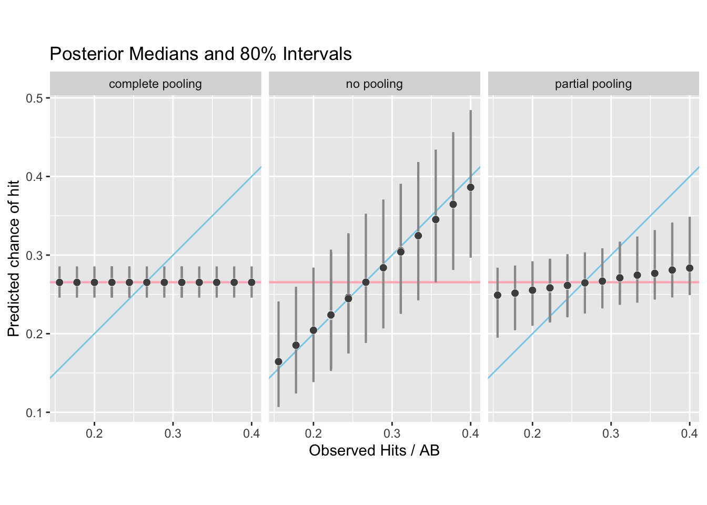

# Class 14: Hierarchical Models

## Example 1: Bristol babies

:::{.example #bristol-babies name="Bristol babies" .lizi}

The [Bristol heart scandal](https://en.wikipedia.org/wiki/Bristol_heart_scandal came about after it was discovered that babies were dying at high rates after cardiac surgery when treated at the [Bristol Royal Infirmary](https://en.wikipedia.org/wiki/Bristol_Royal_Infirmary). The comprehensive report [@Kennedy:2001] subsequently led to substantial changes in health service monitoring in the UK. Data from this incident was statistically analyzed in [@Spiegelhalter:2002] and [@Marshall:2007], and includes the table below. The following models are fit: 

* constant-risk model
\[
\begin{split}
X_i&\sim\text{Binomial}(n_i,\theta)\\
\theta&\sim\text{Uniform}(0,1)
\end{split}
\]
* independent parameters model
\[
\begin{split}
X_i&\sim\text{Binomial}(n_i,\theta_i)\\
\theta_i&\sim\text{Uniform}(0,1)
\end{split}
\]
* hierarchical model
\[
\begin{split}
X_i&\sim\text{Binomial}(n_i,\theta_i)\\
\text{logit_i}(\theta)&\sim \mathcal{N}(\mu,\sigma^2)\\
\mu&\sim\text{Uniform}(-100,100)\\
1/\sigma^2&\sim\text{Uniform}(0,100)
\end{split}
\]
Residual analysis of the constant-risk model shows a poor model selection. Shrinkage is observed for the parameters in the hierarchical model.
:::


```r
library(tidyverse)
library(kableExtra)
bristol = data.frame(hospital = c("Bristol", "Leicester", "Leeds",
    "Oxford", "Guys", "Liverpool", "Southampton", "Great Ormond St",
    "Newcastle", "Harefield", "Birmingham", "Brompton"), operations = c(143,
    187, 323, 122, 164, 405, 239, 482, 195, 177, 581, 301), deaths = c(41,
    25, 24, 23, 25, 42, 24, 53, 26, 25, 58, 31)) %>%
    mutate(mortality = deaths/operations) %>%
    arrange(desc(mortality))

# xtable(bristol,digits=c(0,0,0,0,2))

kbl(bristol) %>%
    kable_classic_2(full_width = F)
```

<table class=" lightable-classic-2" style='font-family: "Arial Narrow", "Source Sans Pro", sans-serif; width: auto !important; margin-left: auto; margin-right: auto;'>
 <thead>
  <tr>
   <th style="text-align:left;"> hospital </th>
   <th style="text-align:right;"> operations </th>
   <th style="text-align:right;"> deaths </th>
   <th style="text-align:right;"> mortality </th>
  </tr>
 </thead>
<tbody>
  <tr>
   <td style="text-align:left;"> Bristol </td>
   <td style="text-align:right;"> 143 </td>
   <td style="text-align:right;"> 41 </td>
   <td style="text-align:right;"> 0.2867133 </td>
  </tr>
  <tr>
   <td style="text-align:left;"> Oxford </td>
   <td style="text-align:right;"> 122 </td>
   <td style="text-align:right;"> 23 </td>
   <td style="text-align:right;"> 0.1885246 </td>
  </tr>
  <tr>
   <td style="text-align:left;"> Guys </td>
   <td style="text-align:right;"> 164 </td>
   <td style="text-align:right;"> 25 </td>
   <td style="text-align:right;"> 0.1524390 </td>
  </tr>
  <tr>
   <td style="text-align:left;"> Harefield </td>
   <td style="text-align:right;"> 177 </td>
   <td style="text-align:right;"> 25 </td>
   <td style="text-align:right;"> 0.1412429 </td>
  </tr>
  <tr>
   <td style="text-align:left;"> Leicester </td>
   <td style="text-align:right;"> 187 </td>
   <td style="text-align:right;"> 25 </td>
   <td style="text-align:right;"> 0.1336898 </td>
  </tr>
  <tr>
   <td style="text-align:left;"> Newcastle </td>
   <td style="text-align:right;"> 195 </td>
   <td style="text-align:right;"> 26 </td>
   <td style="text-align:right;"> 0.1333333 </td>
  </tr>
  <tr>
   <td style="text-align:left;"> Great Ormond St </td>
   <td style="text-align:right;"> 482 </td>
   <td style="text-align:right;"> 53 </td>
   <td style="text-align:right;"> 0.1099585 </td>
  </tr>
  <tr>
   <td style="text-align:left;"> Liverpool </td>
   <td style="text-align:right;"> 405 </td>
   <td style="text-align:right;"> 42 </td>
   <td style="text-align:right;"> 0.1037037 </td>
  </tr>
  <tr>
   <td style="text-align:left;"> Brompton </td>
   <td style="text-align:right;"> 301 </td>
   <td style="text-align:right;"> 31 </td>
   <td style="text-align:right;"> 0.1029900 </td>
  </tr>
  <tr>
   <td style="text-align:left;"> Southampton </td>
   <td style="text-align:right;"> 239 </td>
   <td style="text-align:right;"> 24 </td>
   <td style="text-align:right;"> 0.1004184 </td>
  </tr>
  <tr>
   <td style="text-align:left;"> Birmingham </td>
   <td style="text-align:right;"> 581 </td>
   <td style="text-align:right;"> 58 </td>
   <td style="text-align:right;"> 0.0998279 </td>
  </tr>
  <tr>
   <td style="text-align:left;"> Leeds </td>
   <td style="text-align:right;"> 323 </td>
   <td style="text-align:right;"> 24 </td>
   <td style="text-align:right;"> 0.0743034 </td>
  </tr>
</tbody>
</table>

### Constant-risk model


```r
model = function() {

    ## Likelihood
    for (i in 1:12) {
        y[i] ~ dbin(theta, n[i])
        res[i] <- (y[i] - n[i] * theta)/sqrt(n[i] * theta * (1 -
            theta))
        res2[i] <- res[i] * res[i]
    }

    ## prior
    theta ~ dunif(0, 1)
    X2.obs <- sum(res2[])

}


data = list(n = bristol$operations, y = bristol$deaths)

library(R2jags)
fit <- jags(data = data, model = model, parameters.to.save = c("theta",
    "res", "X2.obs"), n.chain = 2, n.iter = 5000, n.thin = 1,
    n.burn = 100, DIC = FALSE)
module glm loaded
module dic loaded
Compiling model graph
   Resolving undeclared variables
   Allocating nodes
Graph information:
   Observed stochastic nodes: 12
   Unobserved stochastic nodes: 1
   Total graph size: 102

Initializing model
fit.mcmc <- as.mcmc(fit)
summary(fit.mcmc)

Iterations = 101:5000
Thinning interval = 1 
Number of chains = 2 
Sample size per chain = 4900 

1. Empirical mean and standard deviation for each variable,
   plus standard error of the mean:

           Mean       SD  Naive SE Time-series SE
res[1]   6.1499 0.329142 0.0033248      4.275e-03
res[10] -0.9222 0.246955 0.0024946      3.209e-03
res[11] -1.4817 0.384158 0.0038806      4.992e-03
res[12] -2.5181 0.257998 0.0026062      3.353e-03
res[2]   2.3392 0.236772 0.0023918      3.076e-03
res[3]   1.2884 0.245869 0.0024836      3.194e-03
res[4]   0.8796 0.246193 0.0024869      3.199e-03
res[5]   0.5859 0.246649 0.0024915      3.205e-03
res[6]   0.5830 0.251561 0.0025411      3.268e-03
res[7]  -0.6644 0.363689 0.0036738      4.726e-03
res[8]  -0.9968 0.325572 0.0032888      4.230e-03
res[9]  -0.8975 0.279907 0.0028275      3.637e-03
theta    0.1199 0.005574 0.0000563      7.253e-05
X2.obs  59.0388 2.764042 0.0279210      3.679e-02

2. Quantiles for each variable:

           2.5%     25%     50%     75%    97.5%
res[1]   5.5309  5.9250  6.1440  6.3703  6.80791
res[10] -1.3919 -1.0900 -0.9248 -0.7557 -0.43395
res[11] -2.2125 -1.7428 -1.4857 -1.2227 -0.72224
res[12] -3.0102 -2.6931 -2.5202 -2.3438 -2.00949
res[2]   1.8919  2.1778  2.3357  2.4982  2.81052
res[3]   0.8229  1.1210  1.2852  1.4537  1.77674
res[4]   0.4131  0.7120  0.8765  1.0452  1.36818
res[5]   0.1182  0.4181  0.5829  0.7519  1.07509
res[6]   0.1060  0.4118  0.5799  0.7523  1.08189
res[7]  -1.3555 -0.9116 -0.6684 -0.4194  0.05536
res[8]  -1.6159 -1.2181 -1.0002 -0.7774 -0.35289
res[9]  -1.4298 -1.0877 -0.9004 -0.7088 -0.34393
theta    0.1092  0.1161  0.1198  0.1236  0.13077
X2.obs  56.7590 57.0736 58.0523 60.0141 66.59561
```


```r
mat=as.matrix(as.mcmc(fit))
theta.avg=mean(mat[,"theta"])
boxplot(mat[,paste0("res[",1:12,"]")])
abline(h=0)
```


```r

library("bayesplot")
library("ggplot2")
plot_title <- ggtitle("Posterior distributions  of residuals",
                      "with medians and 95% intervals")
mcmc_areas(mat,
           pars = paste0("res[",1:12,"]"),
           prob = 0.95) + plot_title
```


### Independent-parameters model 


```r
model = function() {

    ## Likelihood
    for (i in 1:12) {
        y[i] ~ dbin(theta[i], n[i])
    }

    ## priors
    for (i in 1:12) {
        theta[i] ~ dunif(0, 1)
    }
}


data = list(n = bristol$operations, y = bristol$deaths)

fit <- jags(data = data, model = model, parameters.to.save = c("theta"),
    n.chain = 2, n.iter = 5000, n.thin = 1, n.burn = 100, DIC = FALSE)
Compiling model graph
   Resolving undeclared variables
   Allocating nodes
Graph information:
   Observed stochastic nodes: 12
   Unobserved stochastic nodes: 12
   Total graph size: 38

Initializing model
fit.mcmc <- as.mcmc(fit)
summary(fit.mcmc)

Iterations = 101:5000
Thinning interval = 1 
Number of chains = 2 
Sample size per chain = 4900 

1. Empirical mean and standard deviation for each variable,
   plus standard error of the mean:

             Mean      SD  Naive SE Time-series SE
theta[1]  0.28964 0.03750 0.0003788      0.0004795
theta[10] 0.10412 0.01983 0.0002004      0.0002510
theta[11] 0.10153 0.01264 0.0001277      0.0001647
theta[12] 0.07702 0.01484 0.0001499      0.0001984
theta[2]  0.19362 0.03521 0.0003557      0.0004463
theta[3]  0.15707 0.02807 0.0002836      0.0003602
theta[4]  0.14576 0.02647 0.0002674      0.0003341
theta[5]  0.13724 0.02476 0.0002501      0.0003207
theta[6]  0.13719 0.02426 0.0002451      0.0003026
theta[7]  0.11155 0.01438 0.0001452      0.0001784
theta[8]  0.10582 0.01518 0.0001533      0.0001856
theta[9]  0.10571 0.01731 0.0001749      0.0002253

2. Quantiles for each variable:

             2.5%     25%     50%     75%  97.5%
theta[1]  0.21849 0.26348 0.28889 0.31486 0.3648
theta[10] 0.06844 0.08992 0.10300 0.11692 0.1452
theta[11] 0.07819 0.09279 0.10081 0.10985 0.1277
theta[12] 0.05004 0.06676 0.07615 0.08638 0.1084
theta[2]  0.12915 0.16876 0.19118 0.21676 0.2668
theta[3]  0.10638 0.13730 0.15578 0.17537 0.2154
theta[4]  0.09786 0.12732 0.14413 0.16325 0.2013
theta[5]  0.09274 0.11992 0.13583 0.15317 0.1899
theta[6]  0.09294 0.12013 0.13596 0.15311 0.1885
theta[7]  0.08494 0.10161 0.11087 0.12091 0.1411
theta[8]  0.07796 0.09523 0.10536 0.11565 0.1369
theta[9]  0.07422 0.09363 0.10484 0.11682 0.1420
```


```r
mat=as.matrix(as.mcmc(fit))

mat.ind=mat[,paste0("theta[",1:12,"]")]

plot_title <- ggtitle("Posterior distributions of thetas",
                      "with medians and 95% intervals")
mcmc_areas(mat,
           pars = paste0("theta[",1:12,"]"),
           prob = 0.95) + plot_title
```


### Hierarchical model 


```r
model = function() {

    ## Likelihood
    for (i in 1:12) {
        y[i] ~ dbin(theta[i], n[i])
        logit(theta[i]) <- logit.theta[i]
        logit.theta[i] ~ dnorm(mu, inv.sigma.squared)
    }

    ## priors
    inv.sigma.squared <- 1/pow(sigma, 2)
    sigma ~ dunif(0, 100)
    mu ~ dunif(-100, 100)
}


data = list(n = bristol$operations, y = bristol$deaths)

fit <- jags(data = data, model = model, parameters.to.save = c("theta",
    "mu", "sigma"), n.chain = 2, n.iter = 5000, n.thin = 1, n.burn = 100,
    DIC = FALSE)
Compiling model graph
   Resolving undeclared variables
   Allocating nodes
Graph information:
   Observed stochastic nodes: 12
   Unobserved stochastic nodes: 14
   Total graph size: 57

Initializing model
fit.mcmc <- as.mcmc(fit)
summary(fit.mcmc)

Iterations = 101:5000
Thinning interval = 1 
Number of chains = 2 
Sample size per chain = 4900 

1. Empirical mean and standard deviation for each variable,
   plus standard error of the mean:

             Mean      SD  Naive SE Time-series SE
mu        -1.9309 0.14106 0.0014249      0.0018997
sigma      0.4267 0.13195 0.0013329      0.0027037
theta[1]   0.2496 0.03701 0.0003738      0.0006270
theta[10]  0.1064 0.01787 0.0001805      0.0002226
theta[11]  0.1026 0.01216 0.0001229      0.0001658
theta[12]  0.0842 0.01455 0.0001469      0.0002097
theta[2]   0.1706 0.03012 0.0003043      0.0004233
theta[3]   0.1462 0.02427 0.0002452      0.0003174
theta[4]   0.1376 0.02296 0.0002319      0.0002905
theta[5]   0.1325 0.02208 0.0002230      0.0002816
theta[6]   0.1325 0.02183 0.0002205      0.0002934
theta[7]   0.1123 0.01355 0.0001368      0.0001707
theta[8]   0.1072 0.01433 0.0001447      0.0001817
theta[9]   0.1073 0.01641 0.0001658      0.0002192

2. Quantiles for each variable:

              2.5%      25%      50%     75%   97.5%
mu        -2.20675 -2.01880 -1.93144 -1.8430 -1.6404
sigma      0.22923  0.33369  0.40612  0.4949  0.7390
theta[1]   0.18085  0.22344  0.24890  0.2739  0.3248
theta[10]  0.07354  0.09376  0.10572  0.1179  0.1436
theta[11]  0.07990  0.09428  0.10233  0.1108  0.1271
theta[12]  0.05739  0.07400  0.08348  0.0935  0.1146
theta[2]   0.11831  0.14911  0.16852  0.1895  0.2361
theta[3]   0.10274  0.12908  0.14512  0.1617  0.1969
theta[4]   0.09650  0.12162  0.13623  0.1522  0.1865
theta[5]   0.09314  0.11694  0.13132  0.1469  0.1797
theta[6]   0.09328  0.11738  0.13131  0.1462  0.1791
theta[7]   0.08697  0.10293  0.11178  0.1214  0.1398
theta[8]   0.08073  0.09723  0.10653  0.1165  0.1368
theta[9]   0.07744  0.09571  0.10644  0.1181  0.1416
```


```r
mat=as.matrix(as.mcmc(fit))

mat.hier=mat[,paste0("theta[",1:12,"]")]

plot_title <- ggtitle("Posterior distributions of thetas",
                      "with medians and 95% intervals")
mcmc_areas(mat,
           pars = paste0("theta[",1:12,"]"),
           prob = 0.95) + plot_title
```


```r
library(reshape2)
df1 = melt(mat.ind) %>%
    mutate(model = "independent")
df2 = melt(mat.hier) %>%
    mutate(model = "hierarchical")
df = bind_rows(df1, df2)
df$hospital = c("Bristol", "Leicester", "Leeds", "Oxford", "Guys",
    "Liverpool", "Southampton", "Great Ormond St", "Newcastle",
    "Harefield", "Birmingham", "Brompton")[as.numeric(as.factor(df$Var2))]

library(tidyverse)
library(hrbrthemes)
library(viridis)
library(ggridges)

df %>%
    ggplot(aes(y = hospital, x = value, fill = model)) + geom_density_ridges(alpha = 0.6) +
    scale_fill_viridis(discrete = TRUE) + scale_color_viridis(discrete = TRUE) +
    theme_ipsum() + theme(panel.spacing = unit(0.1, "lines"),
    strip.text.x = element_text(size = 8)) + xlab("") + ylab("Posterior Distributions") +
    geom_vline(xintercept = theta.avg, linetype = "dotted", color = "blue",
        size = 1.5)
Warning: Using `size` aesthetic for lines was deprecated in ggplot2
3.4.0.
ℹ Please use `linewidth` instead.
Picking joint bandwidth of 0.00308
```


Vertical line is the mean theta parameter from the constant-risk model

## Example 2: James-Stein Baseball

:::{.example #baseball name="James-Stein baseball" .lizi}
See [this vignette](https://mc-stan.org/rstanarm/articles/pooling.html) for more details of this example. The James-Stein baseball data [@Efron:1977] is analyzed using `stan_glm` in the `rstanarm` package. This includes model fits with complete pooling (constant-risk model), no pooling (independent-parameter model), and partial pooling (hierarchical model). 
:::


```r
library(rstanarm)
Loading required package: Rcpp
This is rstanarm version 2.21.3
- See https://mc-stan.org/rstanarm/articles/priors for changes to default priors!
- Default priors may change, so it's safest to specify priors, even if equivalent to the defaults.
- For execution on a local, multicore CPU with excess RAM we recommend calling
  options(mc.cores = parallel::detectCores())
data(bball1970)
bball <- bball1970

# xtable(bball)

kbl(bball) %>%
    kable_classic_2(full_width = F)
```

<table class=" lightable-classic-2" style='font-family: "Arial Narrow", "Source Sans Pro", sans-serif; width: auto !important; margin-left: auto; margin-right: auto;'>
 <thead>
  <tr>
   <th style="text-align:left;"> Player </th>
   <th style="text-align:right;"> AB </th>
   <th style="text-align:right;"> Hits </th>
   <th style="text-align:right;"> RemainingAB </th>
   <th style="text-align:right;"> RemainingHits </th>
  </tr>
 </thead>
<tbody>
  <tr>
   <td style="text-align:left;"> Clemente </td>
   <td style="text-align:right;"> 45 </td>
   <td style="text-align:right;"> 18 </td>
   <td style="text-align:right;"> 367 </td>
   <td style="text-align:right;"> 127 </td>
  </tr>
  <tr>
   <td style="text-align:left;"> Robinson </td>
   <td style="text-align:right;"> 45 </td>
   <td style="text-align:right;"> 17 </td>
   <td style="text-align:right;"> 426 </td>
   <td style="text-align:right;"> 127 </td>
  </tr>
  <tr>
   <td style="text-align:left;"> Howard </td>
   <td style="text-align:right;"> 45 </td>
   <td style="text-align:right;"> 16 </td>
   <td style="text-align:right;"> 521 </td>
   <td style="text-align:right;"> 144 </td>
  </tr>
  <tr>
   <td style="text-align:left;"> Johnstone </td>
   <td style="text-align:right;"> 45 </td>
   <td style="text-align:right;"> 15 </td>
   <td style="text-align:right;"> 275 </td>
   <td style="text-align:right;"> 61 </td>
  </tr>
  <tr>
   <td style="text-align:left;"> Berry </td>
   <td style="text-align:right;"> 45 </td>
   <td style="text-align:right;"> 14 </td>
   <td style="text-align:right;"> 418 </td>
   <td style="text-align:right;"> 114 </td>
  </tr>
  <tr>
   <td style="text-align:left;"> Spencer </td>
   <td style="text-align:right;"> 45 </td>
   <td style="text-align:right;"> 14 </td>
   <td style="text-align:right;"> 466 </td>
   <td style="text-align:right;"> 126 </td>
  </tr>
  <tr>
   <td style="text-align:left;"> Kessinger </td>
   <td style="text-align:right;"> 45 </td>
   <td style="text-align:right;"> 13 </td>
   <td style="text-align:right;"> 586 </td>
   <td style="text-align:right;"> 155 </td>
  </tr>
  <tr>
   <td style="text-align:left;"> Alvarado </td>
   <td style="text-align:right;"> 45 </td>
   <td style="text-align:right;"> 12 </td>
   <td style="text-align:right;"> 138 </td>
   <td style="text-align:right;"> 29 </td>
  </tr>
  <tr>
   <td style="text-align:left;"> Santo </td>
   <td style="text-align:right;"> 45 </td>
   <td style="text-align:right;"> 11 </td>
   <td style="text-align:right;"> 510 </td>
   <td style="text-align:right;"> 137 </td>
  </tr>
  <tr>
   <td style="text-align:left;"> Swaboda </td>
   <td style="text-align:right;"> 45 </td>
   <td style="text-align:right;"> 11 </td>
   <td style="text-align:right;"> 200 </td>
   <td style="text-align:right;"> 46 </td>
  </tr>
  <tr>
   <td style="text-align:left;"> Petrocelli </td>
   <td style="text-align:right;"> 45 </td>
   <td style="text-align:right;"> 10 </td>
   <td style="text-align:right;"> 538 </td>
   <td style="text-align:right;"> 142 </td>
  </tr>
  <tr>
   <td style="text-align:left;"> Rodriguez </td>
   <td style="text-align:right;"> 45 </td>
   <td style="text-align:right;"> 10 </td>
   <td style="text-align:right;"> 186 </td>
   <td style="text-align:right;"> 42 </td>
  </tr>
  <tr>
   <td style="text-align:left;"> Scott </td>
   <td style="text-align:right;"> 45 </td>
   <td style="text-align:right;"> 10 </td>
   <td style="text-align:right;"> 435 </td>
   <td style="text-align:right;"> 132 </td>
  </tr>
  <tr>
   <td style="text-align:left;"> Unser </td>
   <td style="text-align:right;"> 45 </td>
   <td style="text-align:right;"> 10 </td>
   <td style="text-align:right;"> 277 </td>
   <td style="text-align:right;"> 73 </td>
  </tr>
  <tr>
   <td style="text-align:left;"> Williams </td>
   <td style="text-align:right;"> 45 </td>
   <td style="text-align:right;"> 10 </td>
   <td style="text-align:right;"> 591 </td>
   <td style="text-align:right;"> 195 </td>
  </tr>
  <tr>
   <td style="text-align:left;"> Campaneris </td>
   <td style="text-align:right;"> 45 </td>
   <td style="text-align:right;"> 9 </td>
   <td style="text-align:right;"> 558 </td>
   <td style="text-align:right;"> 159 </td>
  </tr>
  <tr>
   <td style="text-align:left;"> Munson </td>
   <td style="text-align:right;"> 45 </td>
   <td style="text-align:right;"> 8 </td>
   <td style="text-align:right;"> 408 </td>
   <td style="text-align:right;"> 129 </td>
  </tr>
  <tr>
   <td style="text-align:left;"> Alvis </td>
   <td style="text-align:right;"> 45 </td>
   <td style="text-align:right;"> 7 </td>
   <td style="text-align:right;"> 70 </td>
   <td style="text-align:right;"> 14 </td>
  </tr>
</tbody>
</table>

```r

N <- nrow(bball)
K <- bball$AB
y <- bball$Hits
K_new <- bball$RemainingAB
y_new <- bball$RemainingHits

batting_avg <- function(x) print(format(round(x, digits = 3),
    nsmall = 3), quote = FALSE)
player_avgs <- y/K  # player avgs through 45 AB
tot_avg <- sum(y)/sum(K)  # overall avg through 45 AB

cat("Player averages through 45 at-bats:\n")
Player averages through 45 at-bats:
batting_avg(player_avgs)
 [1] 0.400 0.378 0.356 0.333 0.311 0.311 0.289 0.267 0.244
[10] 0.244 0.222 0.222 0.222 0.222 0.222 0.200 0.178 0.156
cat("Overall average through 45 at-bats:\n")
Overall average through 45 at-bats:
batting_avg(tot_avg)
[1] 0.265
```

### Complete pooling


```r
SEED <- 202
wi_prior <- normal(-1, 1)  # weakly informative prior on log-odds
fit_pool <- stan_glm(cbind(Hits, AB - Hits) ~ 1, data = bball, family = binomial("logit"),
                     prior_intercept = wi_prior, seed = SEED)

SAMPLING FOR MODEL 'binomial' NOW (CHAIN 1).
Chain 1: 
Chain 1: Gradient evaluation took 2.2e-05 seconds
Chain 1: 1000 transitions using 10 leapfrog steps per transition would take 0.22 seconds.
Chain 1: Adjust your expectations accordingly!
Chain 1: 
Chain 1: 
Chain 1: Iteration:    1 / 2000 [  0%]  (Warmup)
Chain 1: Iteration:  200 / 2000 [ 10%]  (Warmup)
Chain 1: Iteration:  400 / 2000 [ 20%]  (Warmup)
Chain 1: Iteration:  600 / 2000 [ 30%]  (Warmup)
Chain 1: Iteration:  800 / 2000 [ 40%]  (Warmup)
Chain 1: Iteration: 1000 / 2000 [ 50%]  (Warmup)
Chain 1: Iteration: 1001 / 2000 [ 50%]  (Sampling)
Chain 1: Iteration: 1200 / 2000 [ 60%]  (Sampling)
Chain 1: Iteration: 1400 / 2000 [ 70%]  (Sampling)
Chain 1: Iteration: 1600 / 2000 [ 80%]  (Sampling)
Chain 1: Iteration: 1800 / 2000 [ 90%]  (Sampling)
Chain 1: Iteration: 2000 / 2000 [100%]  (Sampling)
Chain 1: 
Chain 1:  Elapsed Time: 0.015257 seconds (Warm-up)
Chain 1:                0.018122 seconds (Sampling)
Chain 1:                0.033379 seconds (Total)
Chain 1: 

SAMPLING FOR MODEL 'binomial' NOW (CHAIN 2).
Chain 2: 
Chain 2: Gradient evaluation took 5e-06 seconds
Chain 2: 1000 transitions using 10 leapfrog steps per transition would take 0.05 seconds.
Chain 2: Adjust your expectations accordingly!
Chain 2: 
Chain 2: 
Chain 2: Iteration:    1 / 2000 [  0%]  (Warmup)
Chain 2: Iteration:  200 / 2000 [ 10%]  (Warmup)
Chain 2: Iteration:  400 / 2000 [ 20%]  (Warmup)
Chain 2: Iteration:  600 / 2000 [ 30%]  (Warmup)
Chain 2: Iteration:  800 / 2000 [ 40%]  (Warmup)
Chain 2: Iteration: 1000 / 2000 [ 50%]  (Warmup)
Chain 2: Iteration: 1001 / 2000 [ 50%]  (Sampling)
Chain 2: Iteration: 1200 / 2000 [ 60%]  (Sampling)
Chain 2: Iteration: 1400 / 2000 [ 70%]  (Sampling)
Chain 2: Iteration: 1600 / 2000 [ 80%]  (Sampling)
Chain 2: Iteration: 1800 / 2000 [ 90%]  (Sampling)
Chain 2: Iteration: 2000 / 2000 [100%]  (Sampling)
Chain 2: 
Chain 2:  Elapsed Time: 0.015807 seconds (Warm-up)
Chain 2:                0.017317 seconds (Sampling)
Chain 2:                0.033124 seconds (Total)
Chain 2: 

SAMPLING FOR MODEL 'binomial' NOW (CHAIN 3).
Chain 3: 
Chain 3: Gradient evaluation took 1.1e-05 seconds
Chain 3: 1000 transitions using 10 leapfrog steps per transition would take 0.11 seconds.
Chain 3: Adjust your expectations accordingly!
Chain 3: 
Chain 3: 
Chain 3: Iteration:    1 / 2000 [  0%]  (Warmup)
Chain 3: Iteration:  200 / 2000 [ 10%]  (Warmup)
Chain 3: Iteration:  400 / 2000 [ 20%]  (Warmup)
Chain 3: Iteration:  600 / 2000 [ 30%]  (Warmup)
Chain 3: Iteration:  800 / 2000 [ 40%]  (Warmup)
Chain 3: Iteration: 1000 / 2000 [ 50%]  (Warmup)
Chain 3: Iteration: 1001 / 2000 [ 50%]  (Sampling)
Chain 3: Iteration: 1200 / 2000 [ 60%]  (Sampling)
Chain 3: Iteration: 1400 / 2000 [ 70%]  (Sampling)
Chain 3: Iteration: 1600 / 2000 [ 80%]  (Sampling)
Chain 3: Iteration: 1800 / 2000 [ 90%]  (Sampling)
Chain 3: Iteration: 2000 / 2000 [100%]  (Sampling)
Chain 3: 
Chain 3:  Elapsed Time: 0.015199 seconds (Warm-up)
Chain 3:                0.018457 seconds (Sampling)
Chain 3:                0.033656 seconds (Total)
Chain 3: 

SAMPLING FOR MODEL 'binomial' NOW (CHAIN 4).
Chain 4: 
Chain 4: Gradient evaluation took 4e-06 seconds
Chain 4: 1000 transitions using 10 leapfrog steps per transition would take 0.04 seconds.
Chain 4: Adjust your expectations accordingly!
Chain 4: 
Chain 4: 
Chain 4: Iteration:    1 / 2000 [  0%]  (Warmup)
Chain 4: Iteration:  200 / 2000 [ 10%]  (Warmup)
Chain 4: Iteration:  400 / 2000 [ 20%]  (Warmup)
Chain 4: Iteration:  600 / 2000 [ 30%]  (Warmup)
Chain 4: Iteration:  800 / 2000 [ 40%]  (Warmup)
Chain 4: Iteration: 1000 / 2000 [ 50%]  (Warmup)
Chain 4: Iteration: 1001 / 2000 [ 50%]  (Sampling)
Chain 4: Iteration: 1200 / 2000 [ 60%]  (Sampling)
Chain 4: Iteration: 1400 / 2000 [ 70%]  (Sampling)
Chain 4: Iteration: 1600 / 2000 [ 80%]  (Sampling)
Chain 4: Iteration: 1800 / 2000 [ 90%]  (Sampling)
Chain 4: Iteration: 2000 / 2000 [100%]  (Sampling)
Chain 4: 
Chain 4:  Elapsed Time: 0.01666 seconds (Warm-up)
Chain 4:                0.018921 seconds (Sampling)
Chain 4:                0.035581 seconds (Total)
Chain 4: 

invlogit <- plogis  # function(x) 1/(1 + exp(-x))
summary_stats <- function(posterior) {
  x <- invlogit(posterior)  # log-odds -> probabilities
  t(apply(x, 2, quantile, probs = c(0.1, 0.5, 0.9))) 
}

pool <- summary_stats(as.matrix(fit_pool))  # as.matrix extracts the posterior draws
pool <- matrix(pool,  # replicate to give each player the same estimates
               nrow(bball), ncol(pool), byrow = TRUE, 
               dimnames = list(bball$Player, c("10%", "50%", "90%")))
batting_avg(pool)
           10%   50%   90%  
Clemente   0.246 0.265 0.286
Robinson   0.246 0.265 0.286
Howard     0.246 0.265 0.286
Johnstone  0.246 0.265 0.286
Berry      0.246 0.265 0.286
Spencer    0.246 0.265 0.286
Kessinger  0.246 0.265 0.286
Alvarado   0.246 0.265 0.286
Santo      0.246 0.265 0.286
Swaboda    0.246 0.265 0.286
Petrocelli 0.246 0.265 0.286
Rodriguez  0.246 0.265 0.286
Scott      0.246 0.265 0.286
Unser      0.246 0.265 0.286
Williams   0.246 0.265 0.286
Campaneris 0.246 0.265 0.286
Munson     0.246 0.265 0.286
Alvis      0.246 0.265 0.286

invlogit <- plogis  # function(x) 1/(1 + exp(-x))
summary_stats <- function(posterior) {
  x <- invlogit(posterior)  # log-odds -> probabilities
  t(apply(x, 2, quantile, probs = c(0.1, 0.5, 0.9)))
}

pool <- summary_stats(as.matrix(fit_pool))  # as.matrix extracts the posterior draws
pool <- matrix(pool,  # replicate to give each player the same estimates
               nrow(bball), ncol(pool), byrow = TRUE,
               dimnames = list(bball$Player, c("10%", "50%", "90%")))
batting_avg(pool)
           10%   50%   90%  
Clemente   0.246 0.265 0.286
Robinson   0.246 0.265 0.286
Howard     0.246 0.265 0.286
Johnstone  0.246 0.265 0.286
Berry      0.246 0.265 0.286
Spencer    0.246 0.265 0.286
Kessinger  0.246 0.265 0.286
Alvarado   0.246 0.265 0.286
Santo      0.246 0.265 0.286
Swaboda    0.246 0.265 0.286
Petrocelli 0.246 0.265 0.286
Rodriguez  0.246 0.265 0.286
Scott      0.246 0.265 0.286
Unser      0.246 0.265 0.286
Williams   0.246 0.265 0.286
Campaneris 0.246 0.265 0.286
Munson     0.246 0.265 0.286
Alvis      0.246 0.265 0.286
```

### No pooling


```r
fit_nopool <- update(fit_pool, formula = . ~ 0 + Player, prior = wi_prior)

SAMPLING FOR MODEL 'binomial' NOW (CHAIN 1).
Chain 1: 
Chain 1: Gradient evaluation took 3.8e-05 seconds
Chain 1: 1000 transitions using 10 leapfrog steps per transition would take 0.38 seconds.
Chain 1: Adjust your expectations accordingly!
Chain 1: 
Chain 1: 
Chain 1: Iteration:    1 / 2000 [  0%]  (Warmup)
Chain 1: Iteration:  200 / 2000 [ 10%]  (Warmup)
Chain 1: Iteration:  400 / 2000 [ 20%]  (Warmup)
Chain 1: Iteration:  600 / 2000 [ 30%]  (Warmup)
Chain 1: Iteration:  800 / 2000 [ 40%]  (Warmup)
Chain 1: Iteration: 1000 / 2000 [ 50%]  (Warmup)
Chain 1: Iteration: 1001 / 2000 [ 50%]  (Sampling)
Chain 1: Iteration: 1200 / 2000 [ 60%]  (Sampling)
Chain 1: Iteration: 1400 / 2000 [ 70%]  (Sampling)
Chain 1: Iteration: 1600 / 2000 [ 80%]  (Sampling)
Chain 1: Iteration: 1800 / 2000 [ 90%]  (Sampling)
Chain 1: Iteration: 2000 / 2000 [100%]  (Sampling)
Chain 1: 
Chain 1:  Elapsed Time: 0.069053 seconds (Warm-up)
Chain 1:                0.080344 seconds (Sampling)
Chain 1:                0.149397 seconds (Total)
Chain 1: 

SAMPLING FOR MODEL 'binomial' NOW (CHAIN 2).
Chain 2: 
Chain 2: Gradient evaluation took 1.1e-05 seconds
Chain 2: 1000 transitions using 10 leapfrog steps per transition would take 0.11 seconds.
Chain 2: Adjust your expectations accordingly!
Chain 2: 
Chain 2: 
Chain 2: Iteration:    1 / 2000 [  0%]  (Warmup)
Chain 2: Iteration:  200 / 2000 [ 10%]  (Warmup)
Chain 2: Iteration:  400 / 2000 [ 20%]  (Warmup)
Chain 2: Iteration:  600 / 2000 [ 30%]  (Warmup)
Chain 2: Iteration:  800 / 2000 [ 40%]  (Warmup)
Chain 2: Iteration: 1000 / 2000 [ 50%]  (Warmup)
Chain 2: Iteration: 1001 / 2000 [ 50%]  (Sampling)
Chain 2: Iteration: 1200 / 2000 [ 60%]  (Sampling)
Chain 2: Iteration: 1400 / 2000 [ 70%]  (Sampling)
Chain 2: Iteration: 1600 / 2000 [ 80%]  (Sampling)
Chain 2: Iteration: 1800 / 2000 [ 90%]  (Sampling)
Chain 2: Iteration: 2000 / 2000 [100%]  (Sampling)
Chain 2: 
Chain 2:  Elapsed Time: 0.067713 seconds (Warm-up)
Chain 2:                0.076083 seconds (Sampling)
Chain 2:                0.143796 seconds (Total)
Chain 2: 

SAMPLING FOR MODEL 'binomial' NOW (CHAIN 3).
Chain 3: 
Chain 3: Gradient evaluation took 8e-06 seconds
Chain 3: 1000 transitions using 10 leapfrog steps per transition would take 0.08 seconds.
Chain 3: Adjust your expectations accordingly!
Chain 3: 
Chain 3: 
Chain 3: Iteration:    1 / 2000 [  0%]  (Warmup)
Chain 3: Iteration:  200 / 2000 [ 10%]  (Warmup)
Chain 3: Iteration:  400 / 2000 [ 20%]  (Warmup)
Chain 3: Iteration:  600 / 2000 [ 30%]  (Warmup)
Chain 3: Iteration:  800 / 2000 [ 40%]  (Warmup)
Chain 3: Iteration: 1000 / 2000 [ 50%]  (Warmup)
Chain 3: Iteration: 1001 / 2000 [ 50%]  (Sampling)
Chain 3: Iteration: 1200 / 2000 [ 60%]  (Sampling)
Chain 3: Iteration: 1400 / 2000 [ 70%]  (Sampling)
Chain 3: Iteration: 1600 / 2000 [ 80%]  (Sampling)
Chain 3: Iteration: 1800 / 2000 [ 90%]  (Sampling)
Chain 3: Iteration: 2000 / 2000 [100%]  (Sampling)
Chain 3: 
Chain 3:  Elapsed Time: 0.064684 seconds (Warm-up)
Chain 3:                0.074064 seconds (Sampling)
Chain 3:                0.138748 seconds (Total)
Chain 3: 

SAMPLING FOR MODEL 'binomial' NOW (CHAIN 4).
Chain 4: 
Chain 4: Gradient evaluation took 7e-06 seconds
Chain 4: 1000 transitions using 10 leapfrog steps per transition would take 0.07 seconds.
Chain 4: Adjust your expectations accordingly!
Chain 4: 
Chain 4: 
Chain 4: Iteration:    1 / 2000 [  0%]  (Warmup)
Chain 4: Iteration:  200 / 2000 [ 10%]  (Warmup)
Chain 4: Iteration:  400 / 2000 [ 20%]  (Warmup)
Chain 4: Iteration:  600 / 2000 [ 30%]  (Warmup)
Chain 4: Iteration:  800 / 2000 [ 40%]  (Warmup)
Chain 4: Iteration: 1000 / 2000 [ 50%]  (Warmup)
Chain 4: Iteration: 1001 / 2000 [ 50%]  (Sampling)
Chain 4: Iteration: 1200 / 2000 [ 60%]  (Sampling)
Chain 4: Iteration: 1400 / 2000 [ 70%]  (Sampling)
Chain 4: Iteration: 1600 / 2000 [ 80%]  (Sampling)
Chain 4: Iteration: 1800 / 2000 [ 90%]  (Sampling)
Chain 4: Iteration: 2000 / 2000 [100%]  (Sampling)
Chain 4: 
Chain 4:  Elapsed Time: 0.068065 seconds (Warm-up)
Chain 4:                0.08149 seconds (Sampling)
Chain 4:                0.149555 seconds (Total)
Chain 4: 
nopool <- summary_stats(as.matrix(fit_nopool))
rownames(nopool) <- as.character(bball$Player)
batting_avg(nopool)
            
parameters   10%   50%   90%  
  Clemente   0.297 0.386 0.484
  Robinson   0.281 0.365 0.456
  Howard     0.265 0.345 0.434
  Johnstone  0.242 0.325 0.418
  Berry      0.226 0.306 0.390
  Spencer    0.225 0.304 0.391
  Kessinger  0.207 0.284 0.371
  Alvarado   0.188 0.265 0.353
  Santo      0.175 0.246 0.328
  Swaboda    0.175 0.245 0.327
  Petrocelli 0.154 0.223 0.304
  Rodriguez  0.155 0.224 0.303
  Scott      0.159 0.223 0.303
  Unser      0.153 0.224 0.307
  Williams   0.156 0.224 0.304
  Campaneris 0.138 0.204 0.284
  Munson     0.124 0.185 0.260
  Alvis      0.107 0.164 0.241
```


### Partial pooling


```r
fit_partialpool <- stan_glmer(cbind(Hits, AB - Hits) ~ (1 | Player),
    data = bball, family = binomial("logit"), prior_intercept = wi_prior,
    seed = SEED)

SAMPLING FOR MODEL 'binomial' NOW (CHAIN 1).
Chain 1: 
Chain 1: Gradient evaluation took 2.7e-05 seconds
Chain 1: 1000 transitions using 10 leapfrog steps per transition would take 0.27 seconds.
Chain 1: Adjust your expectations accordingly!
Chain 1: 
Chain 1: 
Chain 1: Iteration:    1 / 2000 [  0%]  (Warmup)
Chain 1: Iteration:  200 / 2000 [ 10%]  (Warmup)
Chain 1: Iteration:  400 / 2000 [ 20%]  (Warmup)
Chain 1: Iteration:  600 / 2000 [ 30%]  (Warmup)
Chain 1: Iteration:  800 / 2000 [ 40%]  (Warmup)
Chain 1: Iteration: 1000 / 2000 [ 50%]  (Warmup)
Chain 1: Iteration: 1001 / 2000 [ 50%]  (Sampling)
Chain 1: Iteration: 1200 / 2000 [ 60%]  (Sampling)
Chain 1: Iteration: 1400 / 2000 [ 70%]  (Sampling)
Chain 1: Iteration: 1600 / 2000 [ 80%]  (Sampling)
Chain 1: Iteration: 1800 / 2000 [ 90%]  (Sampling)
Chain 1: Iteration: 2000 / 2000 [100%]  (Sampling)
Chain 1: 
Chain 1:  Elapsed Time: 0.119321 seconds (Warm-up)
Chain 1:                0.125259 seconds (Sampling)
Chain 1:                0.24458 seconds (Total)
Chain 1: 

SAMPLING FOR MODEL 'binomial' NOW (CHAIN 2).
Chain 2: 
Chain 2: Gradient evaluation took 9e-06 seconds
Chain 2: 1000 transitions using 10 leapfrog steps per transition would take 0.09 seconds.
Chain 2: Adjust your expectations accordingly!
Chain 2: 
Chain 2: 
Chain 2: Iteration:    1 / 2000 [  0%]  (Warmup)
Chain 2: Iteration:  200 / 2000 [ 10%]  (Warmup)
Chain 2: Iteration:  400 / 2000 [ 20%]  (Warmup)
Chain 2: Iteration:  600 / 2000 [ 30%]  (Warmup)
Chain 2: Iteration:  800 / 2000 [ 40%]  (Warmup)
Chain 2: Iteration: 1000 / 2000 [ 50%]  (Warmup)
Chain 2: Iteration: 1001 / 2000 [ 50%]  (Sampling)
Chain 2: Iteration: 1200 / 2000 [ 60%]  (Sampling)
Chain 2: Iteration: 1400 / 2000 [ 70%]  (Sampling)
Chain 2: Iteration: 1600 / 2000 [ 80%]  (Sampling)
Chain 2: Iteration: 1800 / 2000 [ 90%]  (Sampling)
Chain 2: Iteration: 2000 / 2000 [100%]  (Sampling)
Chain 2: 
Chain 2:  Elapsed Time: 0.141288 seconds (Warm-up)
Chain 2:                0.106701 seconds (Sampling)
Chain 2:                0.247989 seconds (Total)
Chain 2: 

SAMPLING FOR MODEL 'binomial' NOW (CHAIN 3).
Chain 3: 
Chain 3: Gradient evaluation took 6e-06 seconds
Chain 3: 1000 transitions using 10 leapfrog steps per transition would take 0.06 seconds.
Chain 3: Adjust your expectations accordingly!
Chain 3: 
Chain 3: 
Chain 3: Iteration:    1 / 2000 [  0%]  (Warmup)
Chain 3: Iteration:  200 / 2000 [ 10%]  (Warmup)
Chain 3: Iteration:  400 / 2000 [ 20%]  (Warmup)
Chain 3: Iteration:  600 / 2000 [ 30%]  (Warmup)
Chain 3: Iteration:  800 / 2000 [ 40%]  (Warmup)
Chain 3: Iteration: 1000 / 2000 [ 50%]  (Warmup)
Chain 3: Iteration: 1001 / 2000 [ 50%]  (Sampling)
Chain 3: Iteration: 1200 / 2000 [ 60%]  (Sampling)
Chain 3: Iteration: 1400 / 2000 [ 70%]  (Sampling)
Chain 3: Iteration: 1600 / 2000 [ 80%]  (Sampling)
Chain 3: Iteration: 1800 / 2000 [ 90%]  (Sampling)
Chain 3: Iteration: 2000 / 2000 [100%]  (Sampling)
Chain 3: 
Chain 3:  Elapsed Time: 0.133025 seconds (Warm-up)
Chain 3:                0.143619 seconds (Sampling)
Chain 3:                0.276644 seconds (Total)
Chain 3: 

SAMPLING FOR MODEL 'binomial' NOW (CHAIN 4).
Chain 4: 
Chain 4: Gradient evaluation took 9e-06 seconds
Chain 4: 1000 transitions using 10 leapfrog steps per transition would take 0.09 seconds.
Chain 4: Adjust your expectations accordingly!
Chain 4: 
Chain 4: 
Chain 4: Iteration:    1 / 2000 [  0%]  (Warmup)
Chain 4: Iteration:  200 / 2000 [ 10%]  (Warmup)
Chain 4: Iteration:  400 / 2000 [ 20%]  (Warmup)
Chain 4: Iteration:  600 / 2000 [ 30%]  (Warmup)
Chain 4: Iteration:  800 / 2000 [ 40%]  (Warmup)
Chain 4: Iteration: 1000 / 2000 [ 50%]  (Warmup)
Chain 4: Iteration: 1001 / 2000 [ 50%]  (Sampling)
Chain 4: Iteration: 1200 / 2000 [ 60%]  (Sampling)
Chain 4: Iteration: 1400 / 2000 [ 70%]  (Sampling)
Chain 4: Iteration: 1600 / 2000 [ 80%]  (Sampling)
Chain 4: Iteration: 1800 / 2000 [ 90%]  (Sampling)
Chain 4: Iteration: 2000 / 2000 [100%]  (Sampling)
Chain 4: 
Chain 4:  Elapsed Time: 0.116647 seconds (Warm-up)
Chain 4:                0.084232 seconds (Sampling)
Chain 4:                0.200879 seconds (Total)
Chain 4: 


# shift each player's estimate by intercept (and then drop
# intercept)
shift_draws <- function(draws) {
    sweep(draws[, -1], MARGIN = 1, STATS = draws[, 1], FUN = "+")
}
alphas <- shift_draws(as.matrix(fit_partialpool))
partialpool <- summary_stats(alphas)
partialpool <- partialpool[-nrow(partialpool), ]
rownames(partialpool) <- as.character(bball$Player)
batting_avg(partialpool)
            
parameters   10%   50%   90%  
  Clemente   0.249 0.283 0.349
  Robinson   0.246 0.281 0.341
  Howard     0.243 0.277 0.332
  Johnstone  0.239 0.274 0.324
  Berry      0.237 0.271 0.317
  Spencer    0.238 0.271 0.317
  Kessinger  0.232 0.267 0.309
  Alvarado   0.226 0.265 0.303
  Santo      0.222 0.261 0.298
  Swaboda    0.221 0.261 0.301
  Petrocelli 0.217 0.258 0.293
  Rodriguez  0.215 0.258 0.294
  Scott      0.217 0.259 0.294
  Unser      0.214 0.258 0.295
  Williams   0.215 0.258 0.295
  Campaneris 0.210 0.255 0.292
  Munson     0.204 0.252 0.287
  Alvis      0.195 0.249 0.284
```

### Observed vs estimated


```r
library(ggplot2)
models <- c("complete pooling", "no pooling", "partial pooling")
estimates <- rbind(pool, nopool, partialpool)
colnames(estimates) <- c("lb", "median", "ub")
plotdata <- data.frame(estimates, observed = rep(player_avgs,
    times = length(models)), model = rep(models, each = N), row.names = NULL)

ggplot(plotdata, aes(x = observed, y = median, ymin = lb, ymax = ub)) +
    geom_hline(yintercept = tot_avg, color = "lightpink", size = 0.75) +
    geom_abline(intercept = 0, slope = 1, color = "skyblue") +
    geom_linerange(color = "gray60", size = 0.75) + geom_point(size = 2.5,
    shape = 21, fill = "gray30", color = "white", stroke = 0.2) +
    facet_grid(. ~ model) + coord_fixed() + scale_x_continuous(breaks = c(0.2,
    0.3, 0.4)) + labs(x = "Observed Hits / AB", y = "Predicted chance of hit") +
    ggtitle("Posterior Medians and 80% Intervals")
Warning: Using `size` aesthetic for lines was deprecated in ggplot2
3.4.0.
ℹ Please use `linewidth` instead.
```



:::{.exercise #rats name="Rat tumors" .prob}
(Tarone, 1982)[@Tarone:1982] provides a data set of tumor incidence in historical control groups of rats; specifically endometrial stromal polyps in female lab rats of type F344 and analyzed in (Gelman, 2021)[@Gelman:2021]. The dataset can be accessed [here](http://www.stat.columbia.edu/~gelman/book/data/rats.asc) or loaded in R with the `rstanarm` package using

```r
data(tumors, package = "rstanarm")
```
Fit a hierarchical Bayesian model to the data and reproduce Figure 5.4 on page 113 of (Gelman, 2021)[@Gelman:2021].
:::


## Example 3: ChatGPT

:::{.example #chatgpt name="ChatGPT Hierarchical model" .lizi}
ChatGPT: stan code of a hierarchical model.
:::

Sure! Here is an example of a hierarchical model in Stan. The model assumes that we have a set of data points, y, that come from different groups, and we want to model the variation in the data within each group and the variation in the group means across all groups.


```stan
data {
  int<lower=1> N;  // number of observations
  int<lower=1> K;  // number of groups
  int<lower=1, upper=K> group[N];  // group indicator for each observation
  real y[N];  // observed data
}

parameters {
  real mu0;             // prior mean for group means
  real<lower=0> sigma0;  // prior std. dev. for group means
  real<lower=0> sigma;   // std. dev. of the observations within each group
  vector[K] mu;          // group means
}

model {
  // Priors
  mu ~ normal(mu0, sigma0);  // prior for group means
  sigma ~ cauchy(0, 1);      // weakly informative prior for sigma

  // Likelihood
  for (i in 1:N) {
    y[i] ~ normal(mu[group[i]], sigma);
  }
}
```


```r
library(rstan)
Loading required package: StanHeaders
rstan (Version 2.21.8, GitRev: 2e1f913d3ca3)
For execution on a local, multicore CPU with excess RAM we recommend calling
options(mc.cores = parallel::detectCores()).
To avoid recompilation of unchanged Stan programs, we recommend calling
rstan_options(auto_write = TRUE)

Attaching package: 'rstan'
The following object is masked from 'package:R2jags':

    traceplot
The following object is masked from 'package:coda':

    traceplot
The following object is masked from 'package:tidyr':

    extract

y <- c(22, 18, 23, 17, 21, 19, 25, 16, 24, 20, 23, 18, 27, 21, 26, 19, 22, 20, 23, 21)
group <- c(rep(1, 10), rep(2, 10))


data_list <- list(
  N = length(y), 
  K = length(unique(group)), 
  group = group, 
  y = y
)

fit <- sampling(hierarchical_model, data = data_list, chains = 4)

SAMPLING FOR MODEL '5d501e12f9a845a1624a7fc2585b1bfe' NOW (CHAIN 1).
Chain 1: 
Chain 1: Gradient evaluation took 9e-06 seconds
Chain 1: 1000 transitions using 10 leapfrog steps per transition would take 0.09 seconds.
Chain 1: Adjust your expectations accordingly!
Chain 1: 
Chain 1: 
Chain 1: Iteration:    1 / 2000 [  0%]  (Warmup)
Chain 1: Iteration:  200 / 2000 [ 10%]  (Warmup)
Chain 1: Iteration:  400 / 2000 [ 20%]  (Warmup)
Chain 1: Iteration:  600 / 2000 [ 30%]  (Warmup)
Chain 1: Iteration:  800 / 2000 [ 40%]  (Warmup)
Chain 1: Iteration: 1000 / 2000 [ 50%]  (Warmup)
Chain 1: Iteration: 1001 / 2000 [ 50%]  (Sampling)
Chain 1: Iteration: 1200 / 2000 [ 60%]  (Sampling)
Chain 1: Iteration: 1400 / 2000 [ 70%]  (Sampling)
Chain 1: Iteration: 1600 / 2000 [ 80%]  (Sampling)
Chain 1: Iteration: 1800 / 2000 [ 90%]  (Sampling)
Chain 1: Iteration: 2000 / 2000 [100%]  (Sampling)
Chain 1: 
Chain 1:  Elapsed Time: 0.06359 seconds (Warm-up)
Chain 1:                0.056947 seconds (Sampling)
Chain 1:                0.120537 seconds (Total)
Chain 1: 

SAMPLING FOR MODEL '5d501e12f9a845a1624a7fc2585b1bfe' NOW (CHAIN 2).
Chain 2: 
Chain 2: Gradient evaluation took 3e-06 seconds
Chain 2: 1000 transitions using 10 leapfrog steps per transition would take 0.03 seconds.
Chain 2: Adjust your expectations accordingly!
Chain 2: 
Chain 2: 
Chain 2: Iteration:    1 / 2000 [  0%]  (Warmup)
Chain 2: Iteration:  200 / 2000 [ 10%]  (Warmup)
Chain 2: Iteration:  400 / 2000 [ 20%]  (Warmup)
Chain 2: Iteration:  600 / 2000 [ 30%]  (Warmup)
Chain 2: Iteration:  800 / 2000 [ 40%]  (Warmup)
Chain 2: Iteration: 1000 / 2000 [ 50%]  (Warmup)
Chain 2: Iteration: 1001 / 2000 [ 50%]  (Sampling)
Chain 2: Iteration: 1200 / 2000 [ 60%]  (Sampling)
Chain 2: Iteration: 1400 / 2000 [ 70%]  (Sampling)
Chain 2: Iteration: 1600 / 2000 [ 80%]  (Sampling)
Chain 2: Iteration: 1800 / 2000 [ 90%]  (Sampling)
Chain 2: Iteration: 2000 / 2000 [100%]  (Sampling)
Chain 2: 
Chain 2:  Elapsed Time: 0.064281 seconds (Warm-up)
Chain 2:                0.113505 seconds (Sampling)
Chain 2:                0.177786 seconds (Total)
Chain 2: 

SAMPLING FOR MODEL '5d501e12f9a845a1624a7fc2585b1bfe' NOW (CHAIN 3).
Chain 3: 
Chain 3: Gradient evaluation took 2e-06 seconds
Chain 3: 1000 transitions using 10 leapfrog steps per transition would take 0.02 seconds.
Chain 3: Adjust your expectations accordingly!
Chain 3: 
Chain 3: 
Chain 3: Iteration:    1 / 2000 [  0%]  (Warmup)
Chain 3: Iteration:  200 / 2000 [ 10%]  (Warmup)
Chain 3: Iteration:  400 / 2000 [ 20%]  (Warmup)
Chain 3: Iteration:  600 / 2000 [ 30%]  (Warmup)
Chain 3: Iteration:  800 / 2000 [ 40%]  (Warmup)
Chain 3: Iteration: 1000 / 2000 [ 50%]  (Warmup)
Chain 3: Iteration: 1001 / 2000 [ 50%]  (Sampling)
Chain 3: Iteration: 1200 / 2000 [ 60%]  (Sampling)
Chain 3: Iteration: 1400 / 2000 [ 70%]  (Sampling)
Chain 3: Iteration: 1600 / 2000 [ 80%]  (Sampling)
Chain 3: Iteration: 1800 / 2000 [ 90%]  (Sampling)
Chain 3: Iteration: 2000 / 2000 [100%]  (Sampling)
Chain 3: 
Chain 3:  Elapsed Time: 0.082011 seconds (Warm-up)
Chain 3:                0.004559 seconds (Sampling)
Chain 3:                0.08657 seconds (Total)
Chain 3: 

SAMPLING FOR MODEL '5d501e12f9a845a1624a7fc2585b1bfe' NOW (CHAIN 4).
Chain 4: 
Chain 4: Gradient evaluation took 1e-06 seconds
Chain 4: 1000 transitions using 10 leapfrog steps per transition would take 0.01 seconds.
Chain 4: Adjust your expectations accordingly!
Chain 4: 
Chain 4: 
Chain 4: Iteration:    1 / 2000 [  0%]  (Warmup)
Chain 4: Iteration:  200 / 2000 [ 10%]  (Warmup)
Chain 4: Iteration:  400 / 2000 [ 20%]  (Warmup)
Chain 4: Iteration:  600 / 2000 [ 30%]  (Warmup)
Chain 4: Iteration:  800 / 2000 [ 40%]  (Warmup)
Chain 4: Iteration: 1000 / 2000 [ 50%]  (Warmup)
Chain 4: Iteration: 1001 / 2000 [ 50%]  (Sampling)
Chain 4: Iteration: 1200 / 2000 [ 60%]  (Sampling)
Chain 4: Iteration: 1400 / 2000 [ 70%]  (Sampling)
Chain 4: Iteration: 1600 / 2000 [ 80%]  (Sampling)
Chain 4: Iteration: 1800 / 2000 [ 90%]  (Sampling)
Chain 4: Iteration: 2000 / 2000 [100%]  (Sampling)
Chain 4: 
Chain 4:  Elapsed Time: 0.112318 seconds (Warm-up)
Chain 4:                0.150898 seconds (Sampling)
Chain 4:                0.263216 seconds (Total)
Chain 4: 
Warning: There were 1302 divergent transitions after warmup. See
https://mc-stan.org/misc/warnings.html#divergent-transitions-after-warmup
to find out why this is a problem and how to eliminate them.
Warning: There were 64 transitions after warmup that exceeded the maximum treedepth. Increase max_treedepth above 10. See
https://mc-stan.org/misc/warnings.html#maximum-treedepth-exceeded
Warning: Examine the pairs() plot to diagnose sampling problems
Warning: The largest R-hat is 2.48, indicating chains have not mixed.
Running the chains for more iterations may help. See
https://mc-stan.org/misc/warnings.html#r-hat
Warning: Bulk Effective Samples Size (ESS) is too low, indicating posterior means and medians may be unreliable.
Running the chains for more iterations may help. See
https://mc-stan.org/misc/warnings.html#bulk-ess
Warning: Tail Effective Samples Size (ESS) is too low, indicating posterior variances and tail quantiles may be unreliable.
Running the chains for more iterations may help. See
https://mc-stan.org/misc/warnings.html#tail-ess
summary(fit)
$summary
                mean      se_mean           sd
mu0    -6.298275e+08 5.154460e+08 3.117998e+09
sigma0  6.390084e+09 4.044922e+09 5.993897e+10
sigma   3.087602e+00 1.081049e-01 4.432847e-01
mu[1]   2.048120e+01 5.157305e-02 8.555959e-01
mu[2]   2.196264e+01 5.856025e-02 8.566540e-01
lp__   -4.544949e+01 4.382746e+00 6.785962e+00
                2.5%           25%           50%
mu0    -1.152481e+10 -6.535645e+05     -1.192205
sigma0  3.544969e+01  7.155016e+02 124633.376737
sigma   2.273658e+00  2.743072e+00      3.146192
mu[1]   1.871180e+01  2.005002e+01     20.623289
mu[2]   1.995763e+01  2.154988e+01     22.192814
lp__   -5.799845e+01 -5.099177e+01    -45.296353
                 75%         97.5%      n_eff     Rhat
mu0     4.315170e+03  5.629451e+07  36.591945 1.089636
sigma0  1.897139e+07  4.043841e+10 219.582810 1.018855
sigma   3.384626e+00  3.997700e+00  16.814149 1.105850
mu[1]   2.084043e+01  2.222828e+01 275.227474 1.014660
mu[2]   2.234381e+01  2.357954e+01 213.995673 1.025934
lp__   -3.838686e+01 -3.651638e+01   2.397344 2.646097

$c_summary
, , chains = chain:1

         stats
parameter          mean           sd          2.5%
   mu0    -1.213868e+05 9.210126e+05 -1.674609e+06
   sigma0  3.813515e+06 5.292382e+07  9.421856e+02
   sigma   2.952402e+00 4.715594e-01  2.225707e+00
   mu[1]   2.040602e+01 9.189164e-01  1.873646e+01
   mu[2]   2.195359e+01 8.537906e-01  2.028541e+01
   lp__   -4.424097e+01 3.123154e+00 -5.101272e+01
         stats
parameter          25%          50%           75%
   mu0    -18351.84660  -271.208475   8203.025695
   sigma0   4244.85977 30320.623553 269854.469849
   sigma       2.60069     2.892375      3.212148
   mu[1]      19.83466    20.485363     20.995128
   mu[2]      21.43133    21.969827     22.535255
   lp__      -46.39198   -43.948390    -41.564559
         stats
parameter         97.5%
   mu0     6.085716e+05
   sigma0  1.422902e+07
   sigma   4.084910e+00
   mu[1]   2.214893e+01
   mu[2]   2.351551e+01
   lp__   -3.977647e+01

, , chains = chain:2

         stats
parameter          mean           sd          2.5%
   mu0    -1.268018e+07 3.493743e+07 -1.392716e+08
   sigma0  4.736188e+07 1.726830e+08  9.074468e+03
   sigma   2.981952e+00 4.610764e-01  2.258058e+00
   mu[1]   2.056823e+01 9.609210e-01  1.876735e+01
   mu[2]   2.192077e+01 9.686605e-01  2.020396e+01
   lp__   -4.737915e+01 3.447586e+00 -5.405430e+01
         stats
parameter           25%           50%           75%
   mu0    -1.481877e+06 -14961.500401  3.318149e+04
   sigma0  5.902920e+04 562467.470259  1.083412e+07
   sigma   2.653532e+00      2.915364  3.263645e+00
   mu[1]   1.992267e+01     20.518089  2.109433e+01
   mu[2]   2.124218e+01     21.915103  2.256196e+01
   lp__   -5.011622e+01    -46.829884 -4.452419e+01
         stats
parameter         97.5%
   mu0     3.138132e+06
   sigma0  5.139725e+08
   sigma   4.094776e+00
   mu[1]   2.255482e+01
   mu[2]   2.361500e+01
   lp__   -4.216915e+01

, , chains = chain:3

         stats
parameter       mean sd       2.5%        25%        50%
   mu0     -1.192205  0  -1.192205  -1.192205  -1.192205
   sigma0  35.449693  0  35.449693  35.449693  35.449693
   sigma    3.384626  0   3.384626   3.384626   3.384626
   mu[1]   20.623289  0  20.623289  20.623289  20.623289
   mu[2]   22.192814  0  22.192814  22.192814  22.192814
   lp__   -36.516378  0 -36.516378 -36.516378 -36.516378
         stats
parameter        75%      97.5%
   mu0     -1.192205  -1.192205
   sigma0  35.449693  35.449693
   sigma    3.384626   3.384626
   mu[1]   20.623289  20.623289
   mu[2]   22.192814  22.192814
   lp__   -36.516378 -36.516378

, , chains = chain:4

         stats
parameter          mean           sd          2.5%
   mu0    -2.506509e+09 5.849352e+09 -2.176912e+10
   sigma0  2.550916e+10 1.178711e+11  2.544016e+06
   sigma   3.031428e+00 4.803075e-01  2.227762e+00
   mu[1]   2.032727e+01 1.051396e+00  1.839124e+01
   mu[2]   2.178341e+01 1.087814e+00  1.986658e+01
   lp__   -5.366145e+01 3.181507e+00 -5.994041e+01
         stats
parameter           25%           50%           75%
   mu0    -9.621443e+08 -2.665964e+07  3.509360e+06
   sigma0  2.883706e+07  2.376446e+08  4.859333e+09
   sigma   2.676105e+00  2.975635e+00  3.380330e+00
   mu[1]   1.958696e+01  2.033062e+01  2.107275e+01
   mu[2]   2.103325e+01  2.185355e+01  2.253739e+01
   lp__   -5.630200e+01 -5.330728e+01 -5.100403e+01
         stats
parameter         97.5%
   mu0     1.176575e+09
   sigma0  2.189987e+11
   sigma   4.095057e+00
   mu[1]   2.229776e+01
   mu[2]   2.380866e+01
   lp__   -4.847898e+01
traceplot(fit)
```


```stan
data {
  int<lower=1> N;  // number of observations
  int<lower=1> K;  // number of groups
  int<lower=1, upper=K> group[N];  // group indicator for each observation
  real y[N];  // observed data
}

parameters {
  real<lower=0,upper=50> mu0;             // prior mean for group means
  real<lower=0, upper=50> sigma0;  // prior std. dev. for group means
  real<lower=0, upper=50> sigma;   // std. dev. of the observations within each group
  vector[K] mu;          // group means
}

model {
  // Priors
  mu ~ normal(mu0, sigma0);  // prior for group means
  sigma ~ cauchy(0, 1);      // weakly informative prior for sigma

  // Likelihood
  for (i in 1:N) {
    y[i] ~ normal(mu[group[i]], sigma);
  }
}
```


```r
fit <- sampling(hierarchical_model2, data = data_list, chains = 4,iter=10^4)

SAMPLING FOR MODEL 'f8f3c9bc4f0327a91fdac658f429e39f' NOW (CHAIN 1).
Chain 1: 
Chain 1: Gradient evaluation took 9e-06 seconds
Chain 1: 1000 transitions using 10 leapfrog steps per transition would take 0.09 seconds.
Chain 1: Adjust your expectations accordingly!
Chain 1: 
Chain 1: 
Chain 1: Iteration:    1 / 10000 [  0%]  (Warmup)
Chain 1: Iteration: 1000 / 10000 [ 10%]  (Warmup)
Chain 1: Iteration: 2000 / 10000 [ 20%]  (Warmup)
Chain 1: Iteration: 3000 / 10000 [ 30%]  (Warmup)
Chain 1: Iteration: 4000 / 10000 [ 40%]  (Warmup)
Chain 1: Iteration: 5000 / 10000 [ 50%]  (Warmup)
Chain 1: Iteration: 5001 / 10000 [ 50%]  (Sampling)
Chain 1: Iteration: 6000 / 10000 [ 60%]  (Sampling)
Chain 1: Iteration: 7000 / 10000 [ 70%]  (Sampling)
Chain 1: Iteration: 8000 / 10000 [ 80%]  (Sampling)
Chain 1: Iteration: 9000 / 10000 [ 90%]  (Sampling)
Chain 1: Iteration: 10000 / 10000 [100%]  (Sampling)
Chain 1: 
Chain 1:  Elapsed Time: 0.15204 seconds (Warm-up)
Chain 1:                0.119692 seconds (Sampling)
Chain 1:                0.271732 seconds (Total)
Chain 1: 

SAMPLING FOR MODEL 'f8f3c9bc4f0327a91fdac658f429e39f' NOW (CHAIN 2).
Chain 2: 
Chain 2: Gradient evaluation took 3e-06 seconds
Chain 2: 1000 transitions using 10 leapfrog steps per transition would take 0.03 seconds.
Chain 2: Adjust your expectations accordingly!
Chain 2: 
Chain 2: 
Chain 2: Iteration:    1 / 10000 [  0%]  (Warmup)
Chain 2: Iteration: 1000 / 10000 [ 10%]  (Warmup)
Chain 2: Iteration: 2000 / 10000 [ 20%]  (Warmup)
Chain 2: Iteration: 3000 / 10000 [ 30%]  (Warmup)
Chain 2: Iteration: 4000 / 10000 [ 40%]  (Warmup)
Chain 2: Iteration: 5000 / 10000 [ 50%]  (Warmup)
Chain 2: Iteration: 5001 / 10000 [ 50%]  (Sampling)
Chain 2: Iteration: 6000 / 10000 [ 60%]  (Sampling)
Chain 2: Iteration: 7000 / 10000 [ 70%]  (Sampling)
Chain 2: Iteration: 8000 / 10000 [ 80%]  (Sampling)
Chain 2: Iteration: 9000 / 10000 [ 90%]  (Sampling)
Chain 2: Iteration: 10000 / 10000 [100%]  (Sampling)
Chain 2: 
Chain 2:  Elapsed Time: 0.142322 seconds (Warm-up)
Chain 2:                0.151231 seconds (Sampling)
Chain 2:                0.293553 seconds (Total)
Chain 2: 

SAMPLING FOR MODEL 'f8f3c9bc4f0327a91fdac658f429e39f' NOW (CHAIN 3).
Chain 3: 
Chain 3: Gradient evaluation took 4e-06 seconds
Chain 3: 1000 transitions using 10 leapfrog steps per transition would take 0.04 seconds.
Chain 3: Adjust your expectations accordingly!
Chain 3: 
Chain 3: 
Chain 3: Iteration:    1 / 10000 [  0%]  (Warmup)
Chain 3: Iteration: 1000 / 10000 [ 10%]  (Warmup)
Chain 3: Iteration: 2000 / 10000 [ 20%]  (Warmup)
Chain 3: Iteration: 3000 / 10000 [ 30%]  (Warmup)
Chain 3: Iteration: 4000 / 10000 [ 40%]  (Warmup)
Chain 3: Iteration: 5000 / 10000 [ 50%]  (Warmup)
Chain 3: Iteration: 5001 / 10000 [ 50%]  (Sampling)
Chain 3: Iteration: 6000 / 10000 [ 60%]  (Sampling)
Chain 3: Iteration: 7000 / 10000 [ 70%]  (Sampling)
Chain 3: Iteration: 8000 / 10000 [ 80%]  (Sampling)
Chain 3: Iteration: 9000 / 10000 [ 90%]  (Sampling)
Chain 3: Iteration: 10000 / 10000 [100%]  (Sampling)
Chain 3: 
Chain 3:  Elapsed Time: 0.149872 seconds (Warm-up)
Chain 3:                0.095246 seconds (Sampling)
Chain 3:                0.245118 seconds (Total)
Chain 3: 

SAMPLING FOR MODEL 'f8f3c9bc4f0327a91fdac658f429e39f' NOW (CHAIN 4).
Chain 4: 
Chain 4: Gradient evaluation took 4e-06 seconds
Chain 4: 1000 transitions using 10 leapfrog steps per transition would take 0.04 seconds.
Chain 4: Adjust your expectations accordingly!
Chain 4: 
Chain 4: 
Chain 4: Iteration:    1 / 10000 [  0%]  (Warmup)
Chain 4: Iteration: 1000 / 10000 [ 10%]  (Warmup)
Chain 4: Iteration: 2000 / 10000 [ 20%]  (Warmup)
Chain 4: Iteration: 3000 / 10000 [ 30%]  (Warmup)
Chain 4: Iteration: 4000 / 10000 [ 40%]  (Warmup)
Chain 4: Iteration: 5000 / 10000 [ 50%]  (Warmup)
Chain 4: Iteration: 5001 / 10000 [ 50%]  (Sampling)
Chain 4: Iteration: 6000 / 10000 [ 60%]  (Sampling)
Chain 4: Iteration: 7000 / 10000 [ 70%]  (Sampling)
Chain 4: Iteration: 8000 / 10000 [ 80%]  (Sampling)
Chain 4: Iteration: 9000 / 10000 [ 90%]  (Sampling)
Chain 4: Iteration: 10000 / 10000 [100%]  (Sampling)
Chain 4: 
Chain 4:  Elapsed Time: 0.150819 seconds (Warm-up)
Chain 4:                0.103341 seconds (Sampling)
Chain 4:                0.25416 seconds (Total)
Chain 4: 
Warning: There were 2526 divergent transitions after warmup. See
https://mc-stan.org/misc/warnings.html#divergent-transitions-after-warmup
to find out why this is a problem and how to eliminate them.
Warning: Examine the pairs() plot to diagnose sampling problems
Warning: Bulk Effective Samples Size (ESS) is too low, indicating posterior means and medians may be unreliable.
Running the chains for more iterations may help. See
https://mc-stan.org/misc/warnings.html#bulk-ess
Warning: Tail Effective Samples Size (ESS) is too low, indicating posterior variances and tail quantiles may be unreliable.
Running the chains for more iterations may help. See
https://mc-stan.org/misc/warnings.html#tail-ess
summary(fit)
$summary
             mean    se_mean         sd        2.5%
mu0     21.773695 0.09497232  7.5546068   4.8999552
sigma0  10.815775 0.36591543 11.5133056   0.5344468
sigma    3.017601 0.01841037  0.5128860   2.2135085
mu[1]   20.624575 0.03662711  0.9693533  18.7369353
mu[2]   21.957983 0.01781672  0.9020157  20.1646034
lp__   -33.590058 0.07062162  2.2308671 -38.7741984
              25%        50%        75%      97.5%
mu0     18.998751  21.491047  23.846708  41.737520
sigma0   2.190631   6.135375  15.752049  42.555142
sigma    2.649268   2.947385   3.305782   4.205829
mu[1]   19.984954  20.613969  21.236954  22.551863
mu[2]   21.386678  21.977338  22.517775  23.761531
lp__   -34.877170 -33.247763 -31.979781 -30.185604
           n_eff     Rhat
mu0    6327.4634 1.000883
sigma0  990.0078 1.003645
sigma   776.0979 1.007411
mu[1]   700.4205 1.004426
mu[2]  2563.1425 1.001500
lp__    997.8654 1.002470

$c_summary
, , chains = chain:1

         stats
parameter       mean         sd        2.5%        25%
   mu0     21.727405  7.9922762   3.8346407  18.658644
   sigma0  11.492980 11.7297399   0.8567078   2.595123
   sigma    2.979427  0.4848784   2.1882941   2.621831
   mu[1]   20.588932  0.9069508  18.7952755  19.965409
   mu[2]   21.974154  0.9031054  20.1839491  21.380328
   lp__   -33.707282  2.1519217 -38.7377612 -34.940295
         stats
parameter        50%        75%     97.5%
   mu0     21.463673  24.202531  42.03364
   sigma0   6.770633  16.581002  42.96402
   sigma    2.939741   3.252348   4.06832
   mu[1]   20.623819  21.181776  22.41359
   mu[2]   22.016767  22.541591  23.78466
   lp__   -33.395637 -32.159178 -30.47163

, , chains = chain:2

         stats
parameter       mean         sd        2.5%        25%
   mu0     21.335605  6.8877365   4.9226480  19.352565
   sigma0   9.383172 11.0554807   0.4685313   1.363844
   sigma    3.113694  0.5599424   2.2317992   2.690882
   mu[1]   20.751269  1.0098162  18.7262477  20.064624
   mu[2]   21.925538  0.8492426  20.1407228  21.389642
   lp__   -33.385787  2.1960102 -38.6258793 -34.598588
         stats
parameter       50%        75%      97.5%
   mu0     21.49134  23.026155  38.625201
   sigma0   4.54318  13.603022  40.881743
   sigma    3.04412   3.485659   4.314664
   mu[1]   20.76885  21.561221  22.551863
   mu[2]   21.90414  22.421286  23.609226
   lp__   -32.98935 -31.862509 -30.043203

, , chains = chain:3

         stats
parameter       mean         sd       2.5%        25%
   mu0     22.084594  7.8415662   5.854910  18.882704
   sigma0  11.647049 11.6854851   0.806815   2.770359
   sigma    3.007342  0.5017635   2.213511   2.664547
   mu[1]   20.589152  0.9653974  18.690434  19.965053
   mu[2]   21.954102  0.9571700  20.093463  21.338937
   lp__   -33.741462  2.2886064 -39.017297 -35.031404
         stats
parameter        50%        75%      97.5%
   mu0     21.318323  24.516808  42.910231
   sigma0   7.140857  16.752785  43.725270
   sigma    2.944843   3.276736   4.168438
   mu[1]   20.584467  21.181845  22.644822
   mu[2]   21.935781  22.565154  23.829529
   lp__   -33.428621 -32.161115 -30.251195

, , chains = chain:4

         stats
parameter       mean         sd        2.5%       25%
   mu0     21.947176  7.4292764   5.6138259  19.07052
   sigma0  10.739898 11.4339401   0.4733902   2.15118
   sigma    2.969942  0.4887603   2.2110951   2.62075
   mu[1]   20.568946  0.9814230  18.7105793  19.96346
   mu[2]   21.978139  0.8945921  20.2537256  21.41498
   lp__   -33.525700  2.2663982 -38.6989426 -34.87816
         stats
parameter        50%        75%      97.5%
   mu0     21.637459  23.823351  41.892832
   sigma0   6.034383  15.739733  42.186837
   sigma    2.891319   3.227012   4.104068
   mu[1]   20.524350  21.126342  22.541343
   mu[2]   22.049839  22.527354  23.820328
   lp__   -33.186071 -31.904034 -30.160351
traceplot(fit)
```


