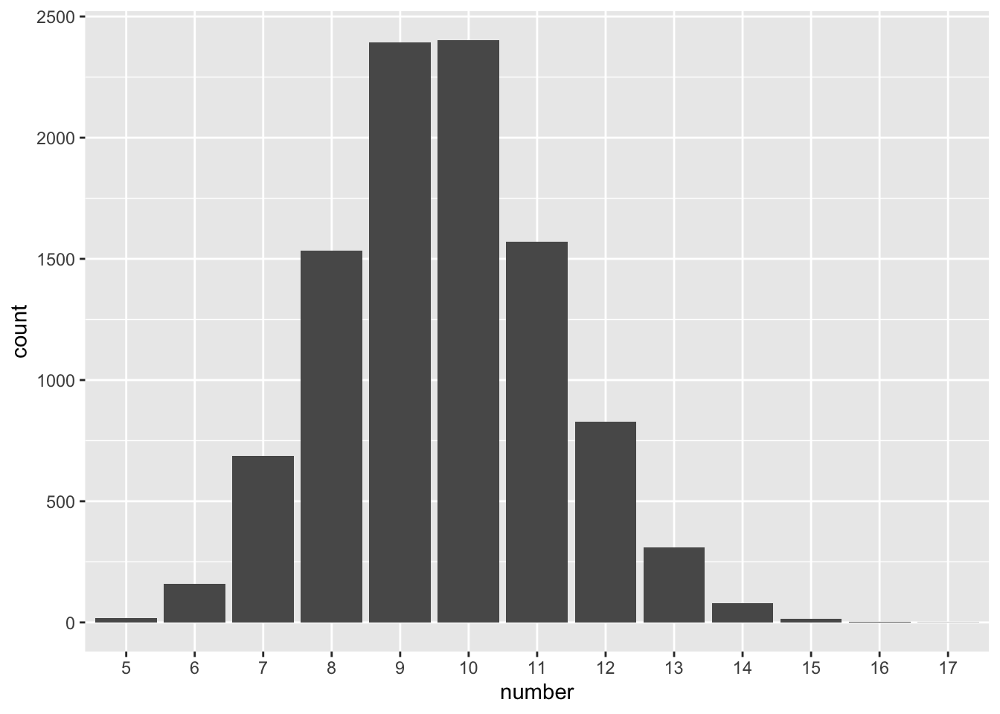

--- 
title: "PHS 528: Bayesian Methods"
author: "Arthur Berg"
date: "2022-10-11"
site: bookdown::bookdown_site
documentclass: book
bibliography: [CompBayesBook.bib, packages.bib]
url: https://arthurberg.github.io/Bayesian
#cover-image: images/cover.jpg
description: 
biblio-style: apalike
csl: chicago-fullnote-bibliography.csl
editor_options: 
  chunk_output_type: console
---


# Class 1

## Probability Fundamentals


:::{.example #binomial-flips name="binomial flips" .lizi}
Consider 100 flips of a fair coin.

(a) What is the probability of observing exactly 50 heads in 100 flips of a fair coin?

(b) What is the probability of observing 50 or more heads?

(c) How many heads would be extreme in the sense that there is less than a 5% chance of observing that many heads or more?
:::


```r
# (a)
dbinom(50, 100, prob = 1/2)
[1] 0.07958924
# (b)
sum(dbinom(50:100, 100, prob = 1/2))
[1] 0.5397946
1 - pbinom(49, 100, prob = 1/2)
[1] 0.5397946
pbinom(49, 100, prob = 1/2, lower.tail = FALSE)
[1] 0.5397946
# (c)
qbinom(0.95, 100, prob = 1/2)
[1] 58
qbinom(0.05, 100, prob = 1/2, lower.tail = FALSE)
[1] 58
1 - pbinom(57, 100, prob = 1/2)
[1] 0.06660531
1 - pbinom(58, 100, prob = 1/2)
[1] 0.04431304
```


:::{.exercise #marbles name="marbles" .prob}
Suppose there’s a bag containing 50 marbles with each marble being either red or yellow. 

(a) Five marbles are randomly selected **with replacement** and each one is found to be yellow. What is the probability all of the marbles in the bag are yellow?

(b) Five marbles are randomly selected **without replacement** and all are found to be yellow. What is the probability all of the marbles in the bag are yellow?
:::

## Monte Carlo

:::{.example #gemstones name="gemstones" .lizi}
Suppose there are $n$ bags labeled $1,\ldots,n$ with bag $i$ containing $i$ rubies and $n-i$ diamonds. Suppose a bag $i$ is selected with probability directly proportional with $i$, and a random gemstone is selected from that bag. What is the probability that it is a diamond? Provide a theoretical calculation and a simulated approximation.
:::


```r
n = 13
Pr_given_B = (1:n)/n
Pr_of_B = (1:n)/sum(1:n)
sum(Pr_given_B * Pr_of_B)
[1] 0.6923077
(2 * n + 1)/(3 * n)
[1] 0.6923077

R = 10^6  # number of random draws
B = 1:n
x1 = sample(B, size = R, replace = T, prob = B)
x2 = sapply(x1, function(x) {
    rbinom(1, 1, prob = x/n)
})
mean(x2)
[1] 0.692506
```

:::{.example #repairs name="repairs" .lizi}
Suppose costs of a repair have a gamma distribution with mean $100 and standard deviation $50.  How many items will I be able to repair for $1000?
:::


```r
R = 10^4  # number of random draws
X.mean = 100
X.var = 50^2
s = X.var/X.mean
a = X.mean/s
a * s  #mean
[1] 100
a * s^2  #variance
[1] 2500

X = rgamma(20, shape = a, scale = s)
cumsum(X)
 [1]   69.91186  207.28872  237.96179  294.58408  325.60142
 [6]  390.36803  568.03599  628.85510  719.53580  854.38467
[11] 1012.79237 1088.89943 1280.43185 1335.85219 1396.11262
[16] 1493.13453 1557.70749 1708.38315 1743.72706 1853.91936
which(cumsum(X) <= 1000)
 [1]  1  2  3  4  5  6  7  8  9 10
max(which(cumsum(X) <= 1000))
[1] 10

res = rep(as.integer(NA), R)
for (i in 1:R) {
    X = rgamma(20, shape = a, scale = s)
    res[i] = max(which(cumsum(X) <= 1000))
}
max(res)
[1] 17
mean(res)
[1] 9.6326
sd(res)
[1] 1.607133

library(ggplot2)
df = data.frame(number = as.factor(res))
ggplot(df, aes(x = number)) + geom_bar()
```



:::{.exercise #icer name="ICER" .prob}
Suppose a patient with heart failure has a survival time that is exponential with mean $\theta_N$ years. Suppose a heart transplant has a $\theta_T$ operative survival rate, and, if they survive, their survival, $s_P$, follows an exponential distribution with mean $\theta_P$. Assume the operation costs $D_{\text{operation}}$ dollars and each post-operative year medical costs for immunosuppressants and other prescriptions amount to $D_\text{annual}$ dollars. 

For the literature questions below, use the [Milliman Research Report on 2020 U.S. organ and tissue transplants](https://www.milliman.com/-/media/milliman/pdfs/articles/2020-us-organ-tissue-transplants.ashx) if possible. Parts (g) and (h) relate to the [incremental cost-effectiveness ratio](https://en.wikipedia.org/wiki/Incremental_cost-effectiveness_ratio). Only part (g) requires Monte Carlo simulation. 

(a) Identify a reasonable value of $\theta_N$ from the literature.

(b) Calculated the monthly mortality based on the value of $\theta_N$ determined in (a).

(c) Identify a reasonable value of $\theta_T$ from the literature.

(d) Identify a reasonable value of $\theta_P$ from the literature.

(e) Identify a reasonable value of $D_{\text{operation}}$ from the literature.

(f) Identify a reasonable value of $D_{\text{annual}}$ from the literature.

(g) Based on the values found above, estimate the expected additional cost per year of life gained by having a transplant? 

(h) Calculate the ratio of the expected additional cost to the expected additional benefit. 
:::


