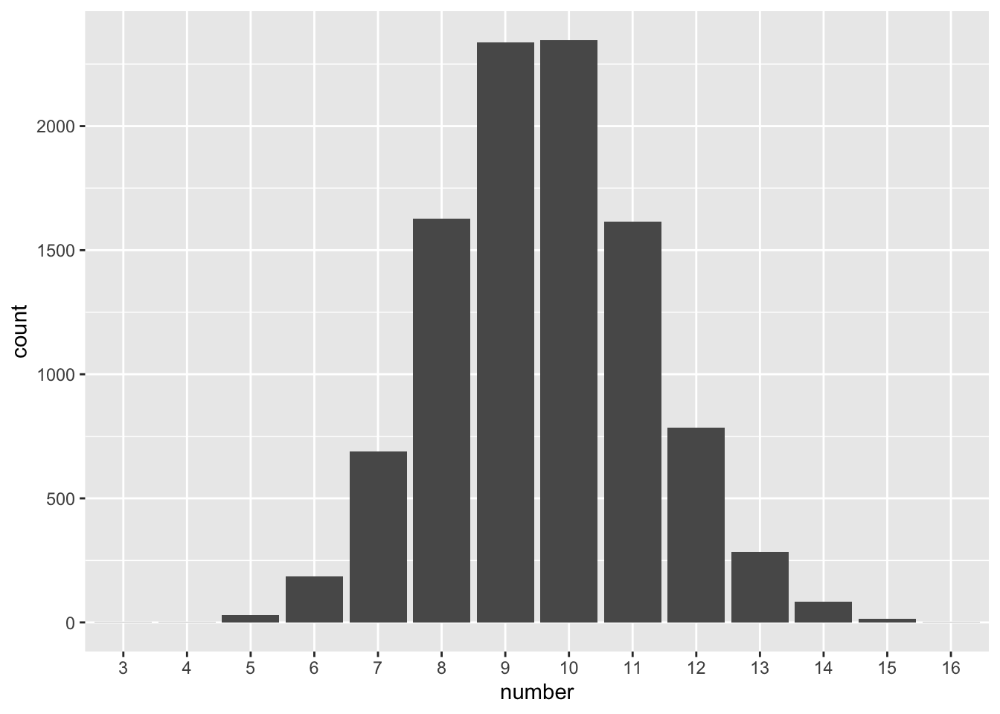

--- 
title: "PHS 528: Bayesian Methods"
author: "Arthur Berg"
date: "2022-09-16"
site: bookdown::bookdown_site
documentclass: book
bibliography: [book.bib, packages.bib]
url: https://bookdown.org/yihui/bookdown
#cover-image: images/cover.jpg
description: 
biblio-style: apalike
csl: chicago-fullnote-bibliography.csl
editor_options: 
  chunk_output_type: console
---

# Fundamentals of Probability

## Coins, Urns, and Bags

:::{.example #flips .lizi}
Consider 100 flips of a fair coin.

(a) What is the probability of observing exactly 50 heads in 100 flips of a fair coin?

(b) What is the probability of observing 50 or more heads?

(c) How many heads would be extreme in the sense that there is less than a 5% chance of observing that many heads or more?
:::


```r
# (a)
dbinom(50,100,prob=1/2)
[1] 0.07958924
# (b)
sum(dbinom(50:100,100,prob=1/2))
[1] 0.5397946
1-pbinom(49,100,prob=1/2)
[1] 0.5397946
pbinom(49,100,prob=1/2,lower.tail=FALSE)
[1] 0.5397946
# (c)
qbinom(.95,100,prob=1/2)
[1] 58
qbinom(.05,100,prob=1/2,lower.tail=FALSE)
[1] 58
1-pbinom(57,100,prob=1/2)
[1] 0.06660531
1-pbinom(58,100,prob=1/2)
[1] 0.04431304
```


:::{.exercise #marbles name="marbles" .prob}
Suppose there’s a bag containing 50 marbles with each marble being either red or yellow. 

(a) Five marbles are randomly selected **with replacement** and each one is found to be yellow. What is the probability all of the marbles in the bag are yellow?

(b) Five marbles are randomly selected **without replacement** and all are found to be yellow. What is the probability all of the marbles in the bag are yellow?
:::

## Monte Carlo

:::{.example #gemstones name="gemstones" .lizi}
Suppose there are $n$ bags labeled $1,\ldots,n$ with bag $i$ containing $i$ rubies and $n-i$ diamonds. Suppose a bag $i$ is selected with probability directly proportional with $i$, and a random gemstone is selected from that bag. What is the probability that it is a diamond? Provide a theoretical calculation and a simulated approximation.
:::


```r
n=13
Pr_given_B=(1:n)/n
Pr_of_B=(1:n)/sum(1:n)
sum(Pr_given_B * Pr_of_B)
[1] 0.6923077
(2*n+1)/(3*n)
[1] 0.6923077

R=10^6 # number of random draws
B=1:n
x1=sample(B,size=R,replace=T,prob=B)
x2=sapply(x1,function(x){rbinom(1,1,prob=x/n)})
mean(x2)  
[1] 0.692364
```

:::{.example #repairs name="repairs" .lizi}
Suppose costs of a repair have a gamma distribution with mean $100 and standard deviation $50.  How many items will I be able to repair for $1000?
:::


```r
R=10^4 # number of random draws
X.mean = 100
X.var = 50^2
s=X.var/X.mean
a=X.mean/s
a*s #mean
[1] 100
a*s^2 #variance
[1] 2500

X = rgamma(20, shape=a, scale = s)
cumsum(X)
 [1]  152.2243  300.7777  352.8082  444.5944  501.6780
 [6]  594.7768  683.3199  768.5335  819.8692  907.9583
[11] 1066.9384 1206.0384 1321.3003 1382.9581 1448.2369
[16] 1636.1918 1654.1601 1835.9000 1903.0882 1958.0845
which(cumsum(X)<=1000)
 [1]  1  2  3  4  5  6  7  8  9 10
max(which(cumsum(X)<=1000))
[1] 10

res=rep(as.integer(NA),R)
for(i in 1:R){
  X = rgamma(20, shape=a, scale = s)
  res[i]=max(which(cumsum(X)<=1000))
}
max(res)
[1] 16
mean(res)
[1] 9.5898
sd(res)
[1] 1.620493

library(ggplot2)
df=data.frame(number=as.factor(res))
ggplot(df, aes(x=number)) + geom_bar()
```



:::{.exercise #icer name="ICER" .prob}
Suppose a patient with heart failure has a survival time $s_N$, which is assumed exponential with mean $\theta_N$ years. 

:::


```r
mu=2 # mean=1/h, median=ln(2)/h
h=1/mu
M=function(t){(1-exp(-h*t))} #prob of event within t years
M(1)
[1] 0.3934693
M(2)
[1] 0.6321206
M(1)/12
[1] 0.03278911
M(12)
[1] 0.9975212
S=function(k,t){1-(1-M(t))^(1/k)}
S(12,1)
[1] 0.04081054
S(24,2)
[1] 0.04081054
S(1,1/12)
[1] 0.04081054
m=1-(1-.0625)^12
-log(1-m)
[1] 0.7744623
1/-log(1-m)
[1] 1.291219
```


